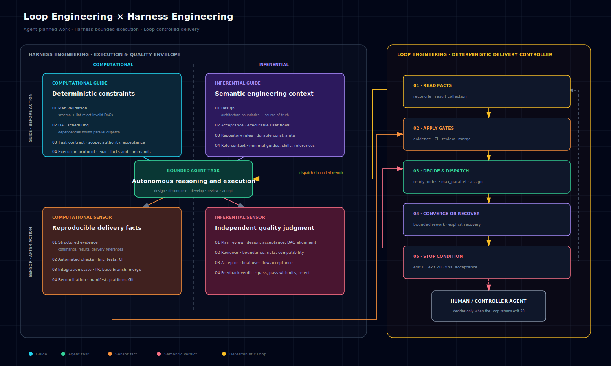
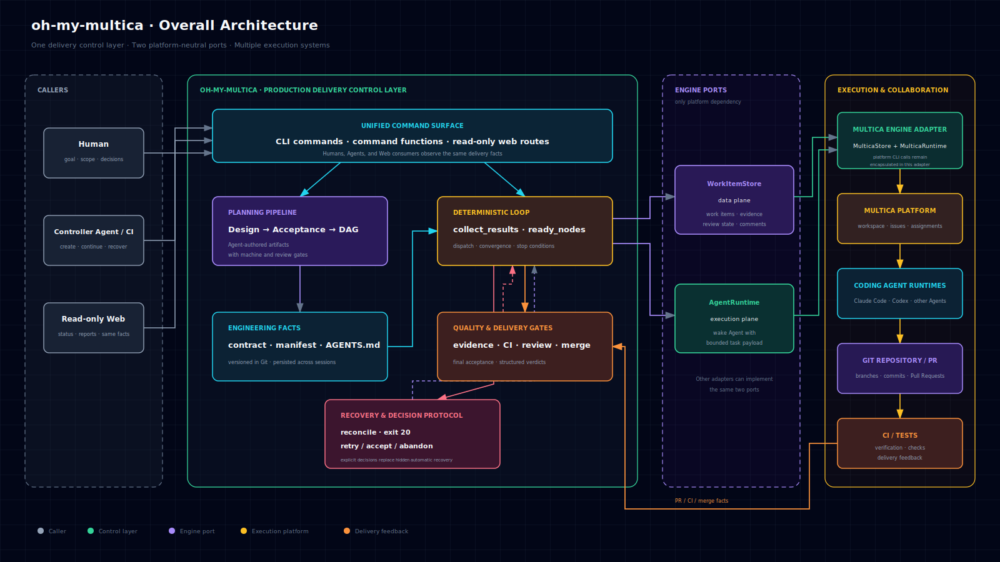
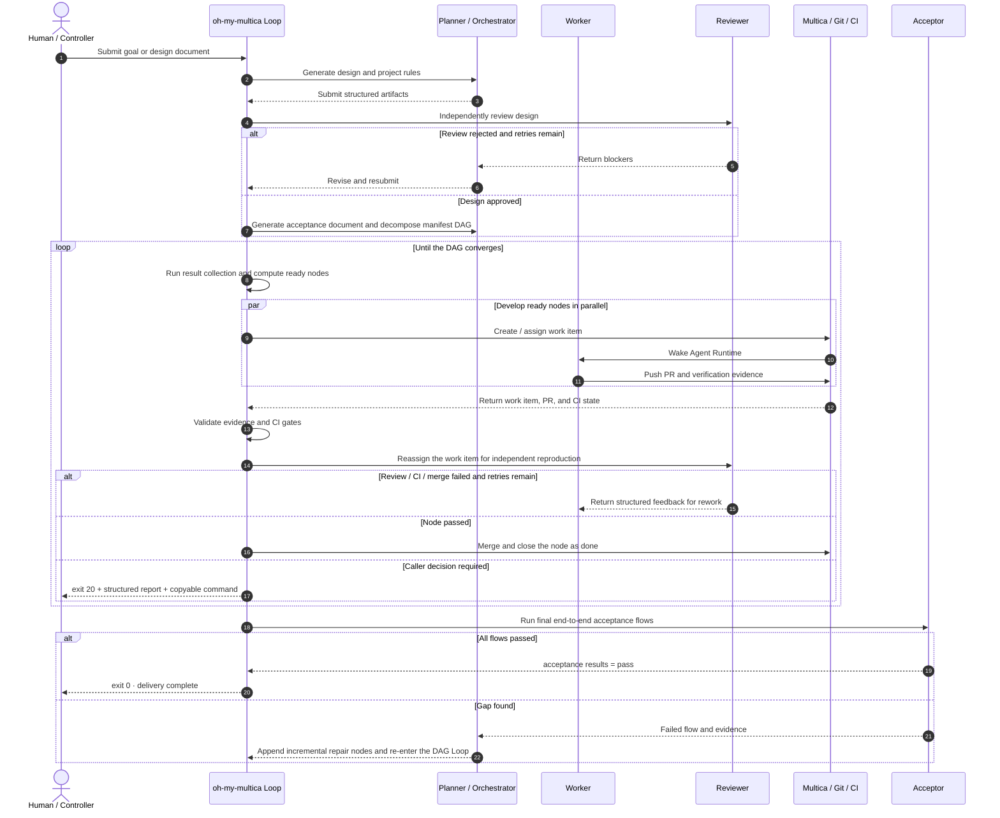

# oh-my-multica

[](https://github.com/xiaohei-info/oh-my-multica/actions/workflows/ci.yml)
[](https://github.com/xiaohei-info/oh-my-multica/releases/tag/v1.0.0)
[](./LICENSE)

[English](README.md) | [简体中文](README.zh-CN.md)

**A production-grade AI software delivery system built on [Multica](https://github.com/multica-ai/multica).**

[Multica](https://github.com/multica-ai/multica) brings Coding Agents such as Claude Code and Codex into
unified workspaces, issues, task queues, and local runtimes. Agents can receive work, report progress and
blockers, and operate like team members, while teams centrally manage execution machines and reusable Skills.
It provides the foundation for task assignment, lifecycle management, runtime scheduling, and state tracking
in multi-Agent collaboration.

Multica focuses primarily on Agent execution and collaboration, but it does not define a complete engineering
delivery process for a software project: how a requirement enters design, how executable acceptance criteria are
formed, how multiple development tasks run in parallel according to dependencies, what evidence proves an
implementation is correct, who performs independent review, when a change may be merged, or how failures recover.

oh-my-multica builds on Multica's excellent mechanism design and adds a more complete software engineering
delivery control layer. It advances a requirement into a software change that has passed design, development,
verification, review, merge, and final acceptance.

**Multica is a complete Agent Runtime task platform that manages how Agents work, while oh-my-multica manages
how software is delivered on top of it.**

## Why oh-my-multica

Coding Agents are already good at writing code. The hard problems usually appear outside the code: requirements
drift during long conversations, multiple Agents change conflicting areas, test results exist only in a written
claim, reviewers trust an author's summary, or a loop that has run for hours silently stops without leaving
recoverable state.

Adding more Agents does not automatically solve these problems. It can make the system more complex and harder
to control.

The core problem oh-my-multica solves is: **how can multiple Coding Agents, with as little human intervention as
possible, fully design, implement, and deliver a requirement as a production-grade software system—not stop at
code generation, a prototype, or a Demo while confidently claiming every feature is complete and ready to ship?**

> **oh-my-multica lowers the organizational barrier to production-grade complex software delivery.** Once the
> goal and acceptance criteria are clear, design, decomposition, development, verification, review, and acceptance
> can be delegated to a scalable Agent Team. The main resources that determine throughput become machine count,
> which controls Agent development concurrency, and Token budget, which controls how much reasoning,
> implementation, retesting, and rework can be invested.

## What oh-my-multica adds on top of Multica

| Mechanism | How oh-my-multica implements it | Problem solved |
| --- | --- | --- |
| Deterministic control flow | The delivery loop owns control; planning, development, review, and acceptance Agents are finite task executors | Prevents a supervising Agent from drifting, forgetting, or stopping early |
| Planning pipeline | Agents dynamically produce design → acceptance document → manifest DAG, with machine gates and review gates between stages | Keeps requirements, design, decomposition, and implementation aligned |
| Verifiable DAG | Agents dynamically plan nodes and parallel paths; every node declares dependencies, owner, reviewer, acceptance, verification commands, and integration gates | Makes parallelism depend on explicit boundaries instead of luck |
| Independent quality judgment | Workers cannot approve their own work; Reviewers reproduce independently, and the Acceptor runs final flow-based acceptance | Prevents author claims from being treated as facts |
| Structured evidence | Verification, review reports, and acceptance results have schemas and submission gates | Makes every “pass” machine-checkable and traceable |
| Delivery closure | Configurable CI, Pull Request merge, and controller-level acceptance; failures return to bounded rework | Prevents “code written” from being mistaken for “delivered” |
| Persistence and recovery | State is stored in the manifest and platform; reruns begin with reconciliation; unresolved failures return exit 20 | Resumes after interruption instead of starting from another prompt |

### How it differs from multi-Agent collaborative development products

| Solution | Collaboration model | Primary problem solved | Best fit |
| --- | --- | --- | --- |
| [Codex App](https://openai.com/index/introducing-the-codex-app/) / [Claude Code Agent Teams](https://code.claude.com/docs/en/agent-teams) | A Human or lead Agent decomposes work, coordinates multiple sessions, threads, or worktrees, and continuously decides what happens next | Parallel development, context isolation, and interactive task division | Work is already well decomposed and a developer is willing to supervise, coordinate, and integrate continuously |
| [Claude Code Dynamic Workflows](https://code.claude.com/docs/en/workflows) | Claude dynamically generates a replayable orchestration script for the current task; the runtime executes its loops, branches, and parallel subagents | Orchestrates large audits, migrations, research, and repeated verification as one executable multi-Agent workflow | A single task needs tens or hundreds of Agents, or the same orchestration needs to be saved and reused |
| [Factory Missions](https://docs.factory.ai/features/missions/overview) | A Droid and user jointly plan features, milestones, and success criteria; the Agent Orchestrator owns the Mission loop and dynamically schedules, replans, and recovers | Lets Agents autonomously advance large, multi-feature, long-running development Missions | Repositories with strong Agent Readiness and scriptable user QA, where a Human is willing to supervise the Agent Orchestrator like a project manager |
| [OpenAI Symphony](https://openai.com/index/open-source-codex-orchestration-symphony/) | An issue tracker stores task state; a background service creates an isolated workspace for each issue and continuously schedules or restarts Coding Agents | Removes the burden of manually maintaining many Coding Agent sessions | Teams with a mature backlog, automated tests, and repository Harness that continuously deliver through issues |
| [MetaGPT](https://github.com/FoundationAgents/MetaGPT) | LLM roles such as product manager, architect, project manager, and engineer exchange software artifacts through an SOP | Turns natural-language requirements into user stories, designs, APIs, documentation, and code repositories | Greenfield generation, multi-Agent workflow research, and projects willing to supply the rest of the delivery chain |
| **oh-my-multica** | **Planner and Orchestrator Agents dynamically plan the delivery path and generate a contract-driven manifest DAG; a deterministic Loop dispatches by dependency, collects evidence, applies quality gates, and advances through final acceptance** | **Combines dynamic planning with deterministic progression and convergence; safely expands development concurrency with cost-efficient Agents without delegating project-completion judgment to a supervising Agent** | **Complex features, multi-module systems, or production-grade software services that need parallel delivery with limited human intervention** |

The most important difference from other multi-Agent collaboration products is not whether planning, parallel
development, or automated verification exists. It is **who owns the complete execution loop**. Factory Missions
also has structured plans, Validator Workers, and retry bounds, but next-step scheduling, replanning, and exception
recovery are primarily decided by an Agent Orchestrator. Humans observe, pause, and correct the Mission through
conversation. This gives Missions strong situational adaptability, but it also makes loop outcomes more dependent
on the Orchestrator's current context, reasoning quality, and Human supervision.

oh-my-multica keeps model uncertainty and freedom where reasoning is actually required: Agents understand
requirements, design solutions, define acceptance, plan the DAG, and execute nodes. Once planning artifacts pass
schema validation, lint, and independent review, deterministic software takes ownership of the loop. Node
dependencies, runtime state, evidence gates, rework limits, merge conditions, recovery entry points, and stop
conditions are not improvised by a supervising Agent.

As a result, oh-my-multica retains autonomous Agent planning and execution while providing stronger and more
stable control flow and mechanism guarantees, with lower Token overhead and higher efficiency per Token.

**Dynamic planning, deterministic execution.** The Planner first produces a design and acceptance definition for
the current project. The Orchestrator then plans the Wave 0 foundation, Wave 1 parallel tracks, and Wave 2
integration and acceptance around real architecture boundaries. Every node declares its contract, dependencies,
Worker, Reviewer, verification commands, and integration gates:

```text
Requirement → Agent-authored design / acceptance / DAG → schema + lint + review → deterministic Loop → development / review / merge / final acceptance
```

This division of responsibilities resembles Claude Code Dynamic Workflows: an Agent plans an orchestration for
the current task, then a runtime executes a deterministic process. The difference is that Claude Code Workflow
produces an executable orchestration script for a particular task, while oh-my-multica produces a versioned DAG
for production software delivery. The DAG defines not only “what runs next,” but also what each delivery node may
do, how it is verified, who reviews it, and what evidence is sufficient to continue.

Within this structure, high-capability models can focus on design, planning, and quality judgment. Cost-efficient
models can handle the largest number of development and testing nodes and consume most of the Tokens. Harness
Engineering provides constraints before action and feedback after action; results that fail their contract,
verification, review, or final acceptance return to rework and cannot enter the delivery chain.

### A real end-to-end delivery

The [Webhook Inbox demo](https://github.com/xiaohei-info/oh-my-multica-demo-webhook-inbox) started from one
production-constrained goal and converged through a dynamically planned five-node DAG and five merged Pull
Requests. The integrated result passed 86 tests with 97.18% coverage, CI on Python 3.10 through 3.13, non-root
container verification, independent review, and final acceptance.

The first final-acceptance round passed only 2 of 11 flows because the reviewed acceptance source still started a
stale application entry point. The Loop preserved the failure and refused completion. After the source was fixed,
the complete acceptance document passed 11/11 and the controller returned exit 0. Read the
[end-to-end case study](docs/case-studies/webhook-inbox-end-to-end.md) for the DAG, role split, public PRs, and
failure evidence.

## Who it is for

- Developers who already use AI Coding heavily and want to move from supervising every conversation to managing goals, constraints, and outcomes.
- Individuals, startups, and engineering teams that want to continuously produce deployable, maintainable software services with as little manual handoff as possible.
- People with limited programming experience who can clearly describe goals and acceptance outcomes and want Agents to follow a complete architecture design and implementation process.
- Teams that need multiple Agents or execution machines without scattering task state across terminals, chat history, and individual memory.

oh-my-multica is not intended for one-off code-snippet generation, and it does not replace business decisions. It
is most valuable when the work is complex enough to justify explicit delivery verification and you want the
system to own repetitive supervision.

## Getting started

> Prerequisite: oh-my-multica must run in a project that has already initialized Git and configured a pushable
> remote repository. Start it from the target repository root. With the Multica engine, configuration and the
> manifest synchronize through `origin/main` by default, while execution Agents deliver through branches, Pull
> Requests, and merges.

### Installation

Prerequisites:

- Python 3.10 or later.
- A target project with Git initialized, at least one commit, and a pushable `origin` remote; the Multica engine synchronizes oh-my-multica state through `origin/main` by default.
- `pipx` for an isolated installation of the oh-my-multica `omac` CLI.
- For the Multica engine, [install the Multica CLI](https://github.com/multica-ai/multica/blob/main/CLI_INSTALL.md), complete `multica login`, and connect Codex, Claude Code, or other Runtimes on the machine to Multica.

```bash
pipx install git+https://github.com/xiaohei-info/oh-my-multica.git@v1.0.0

omac --version
```

The versioned GitHub Tag is the current stable installation source. To install
the latest development revision instead, replace `@v1.0.0` with `@main`.

The more machines connected to Multica, the greater the Agent execution concurrency available. Machines with a
Coding Agent Runtime installed are the actual task execution layer at the bottom of this system.

### For Human

You only need to focus on three things: configure an available Agent Team, describe the goal, and handle decisions
the system cannot make for you.

```bash
omac init
omac plan create --name <feature> --goal "<the outcome you want to deliver>"
```

`plan create` asks the Planner and Orchestrator Agents to produce a design, acceptance document, and dynamically
planned manifest DAG for the current requirement instead of applying a fixed task template. Once planning passes,
run the exact “next step” command from the output and let the deterministic Loop take over development and
delivery. Progress is available through platform issues or `omac web`.

### For Agent

First read the workflow guide:

```bash
omac guide workflow
```

Work from the target project's repository root:

1. Run `omac init --check`. If configuration is missing, follow the error output to complete declarative configuration; do not invoke the Human interactive wizard.
2. Create a plan from the user's goal, or continue an existing manifest.
3. Execute the exact “next step” printed by the command. Do not guess the manifest path, command arguments, or current stage.
4. Keep `dag run` in the foreground until it returns exit 0 or exit 20.
5. Report delivery complete only when exit 0 is returned and the manifest has converged. On exit 20, load `omac guide recovery`; return decisions that change the goal, scope, or accepted risk to the Human.

## Agent Team configuration best practices

oh-my-multica provides built-in templates for planner, orchestrator, worker, reviewer, acceptor, architect,
backend, frontend, pm, and other roles in [`src/omac/agents/`](./src/omac/agents). You can use these templates
directly or borrow their Instructions, responsibility boundaries, and Skill configuration when building your own
Agent Team.

Not every role needs the most expensive model. A better approach is to allocate models according to decision
impact, task risk, and Token consumption:

| Task type | Typical roles | Recommended models | Why |
| --- | --- | --- | --- |
| Design and planning | planner, architect, orchestrator | Flagship GPT or Claude models, or other first-tier models with comparable performance | Invoked relatively few times, but design and decomposition errors are amplified by every downstream task |
| Review and acceptance | reviewer, acceptor | Secondary flagship GPT or Claude models, or other second-tier models with comparable performance | Maintains independent judgment and review quality while controlling reproduction and acceptance costs |
| Development and testing | worker, backend, frontend, and other execution roles | Cost-efficient commercial models, mature open-source models, or other third-tier models | These tasks have the largest volume, concurrency, and Token consumption. Clear contracts and verification gates constrain their results, so **you do not need to worry that lower-capability models will deliver unexpected or out-of-bound results—solving that is exactly the point of this system.** |

## Core design: Loop Engineering × Harness Engineering

**oh-my-multica is an engineering implementation of Loop Engineering and Harness Engineering for production-grade
software delivery.** The Loop continuously reads facts, consumes feedback, advances work, and determines the next
step and stop conditions. The Harness encodes the goals, context, tools, constraints, verification, and review that
every execution round must obey.

### Loop Engineering: connecting feedback, execution, and completion conditions

[Anthropic's “Building Effective Agents”](https://www.anthropic.com/engineering/building-effective-agents)
describes an Agent as an LLM that repeatedly uses tools based on environmental feedback, reads facts after every
step, and decides whether to continue, correct itself, request Human judgment, or stop when completion conditions
are satisfied. Anthropic also distinguishes workflows from agents: workflows follow programmatically predefined
paths, while agents dynamically decide how to complete a task. In the
[official Claude Agent SDK practice](https://www.anthropic.com/engineering/building-agents-with-the-claude-agent-sdk),
this feedback loop is summarized as **gather context → take action → verify work → repeat**.

[OpenAI's Agent Improvement Loop](https://developers.openai.com/cookbook/examples/agents_sdk/agent_improvement_loop)
connects traces, feedback, evaluations, Harness changes, implementation, and revalidation into an executable
improvement loop. [OpenAI's Harness Engineering practice](https://openai.com/index/harness-engineering/) further
decomposes large goals into clearly bounded design, development, review, and testing work units and continuously
returns feedback to execution until verification and review genuinely pass.

The common idea is not to make an Agent “run a few more times,” but to create a closed loop that continuously
performs **observe facts → decide the next step → take action → verify the result → consume feedback → determine
whether to stop**.

Under Anthropic's classification, the outer control plane of oh-my-multica is a deterministic workflow, while
autonomous agents operate inside DAG nodes. This hybrid design is deliberate: models handle reasoning-intensive
work such as design, decomposition, coding, review, and acceptance; software persists state, computes dependencies,
controls concurrency, applies quality gates, and determines whether the complete delivery has converged.
Deterministic control does not mean applying a fixed workflow template. Agents dynamically plan the DAG from the
current repository, design, and acceptance definition; software takes over loop control after the plan passes.

```text
reconcile → result collection (collect_results) → evidence and delivery gates → ready nodes → dispatch → converged / exit 20
```

| Loop Engineering element | How oh-my-multica implements it |
| --- | --- |
| Read facts from the environment | `reconcile` aligns the manifest with platform work items; Git, structured evidence, review reports, and optionally configured Pull Requests and CI are all inspectable facts |
| Decompose goals into advancing steps | Agents dynamically plan Wave 0 / 1 / 2 and node contracts from the design, acceptance definition, and current repository; software computes ready nodes from actual dependencies and `max_parallel` |
| Execute autonomously within boundaries | Each Agent receives only the current node's task, context, contract, authority, and minimal `guide_refs`, then decides how to complete that node internally |
| Correct from feedback | `collect_results` consumes verification, CI, Reviewer, and merge results; failures enter bounded rework, while failures that cannot be handled automatically enter explicit recovery |
| Continue across sessions | State persists in the manifest, platform, and Git; a new Human or Controller Agent continues from the same facts without depending on previous conversational memory |
| Explicit stop conditions | Continue while running nodes exist; return exit 20 when a decision is required; return exit 0 only after every node converges and final acceptance passes |

OpenAI's Agent Improvement Loop primarily describes the “outer loop” that continuously improves Agents and their
Harness. oh-my-multica currently implements the “inner loop” of production software delivery: every round turns
execution results into evidence and feedback, then decides whether to advance, rework, stop, or request a decision.
The Loop does not depend on a supervising Agent remembering to continue, and context resets do not erase delivery
state.

### Harness Engineering: encoding engineering judgment into the environment

A loop alone is not enough. An incorrect goal can be executed quickly and consistently. Harness Engineering
covers the entire environment outside the model: how knowledge is provided, how architecture is constrained, how
results are verified, how errors are fed back, and how state is persisted.
[Anthropic's practice for long-running Agent Harnesses](https://www.anthropic.com/engineering/effective-harnesses-for-long-running-agents)
emphasizes incremental progress, persistent engineering artifacts, and recovery across contexts. OpenAI emphasizes
turning the repository into an Agent-readable system of facts and encoding testing, verification, review, feedback,
and recovery into the environment instead of relying on prompts or continuous Human supervision.

[Harness Engineering](https://martinfowler.com/articles/harness-engineering.html) can be understood along two
dimensions: Guides provide feedforward constraints before an Agent acts, while Sensors provide feedback after an
action; Computational mechanisms use deterministic software, while Inferential mechanisms use models for semantic
analysis. A mature Harness normally combines all four quadrants, with a trusted Loop consuming their signals to
decide whether to continue, rework, stop, or request Human judgment.



oh-my-multica implements these Loop and Harness principles as a CLI protocol, state machine, and evidence model
for production software delivery.

The Harness produces feedforward constraints and feedback signals. The deterministic Loop consumes those signals
and advances state, while Agents perform the reasoning and execution work best suited to models within explicit
boundaries.

## Overall architecture

oh-my-multica does not replace Multica or Coding Agents. It sits between callers and execution platforms, turns
software engineering facts into executable state, and uses Multica's task and runtime capabilities through
uniform interfaces.



## From requirement to delivery

The following swimlane shows the standard path. Design, acceptance, decomposition, and development can all enter
bounded rework. State advances only after evidence satisfies the contract. Failures that cannot be handled
automatically are not swallowed; they return to the caller as exit 20 with an exact next-step command.



## What “production-grade” means

oh-my-multica does not promise that code produced by any Agent is inherently ready for production. Production
quality depends on correct requirements, complete contracts, effective verification commands, configured CI, and
Reviewers and Acceptors with sufficient capability.

The guarantee provided by oh-my-multica is more practical: these critical conditions become explicit facts and
checkpoints in the process instead of remaining hidden in Human memory or chat history.

| Production delivery requirement | Where it is enforced in oh-my-multica |
| --- | --- |
| Requirements do not drift | Design problem / non-goals / flows and acceptance flow IDs |
| Architecture remains maintainable | Core data ownership, module boundaries, cross-module contracts, and project-level `AGENTS.md` |
| Changes preserve existing behavior | Contract source of truth, non-goals, integration gates, and compatibility requirements |
| Results are reproducible | Verification commands, environment setup, and structured evidence |
| Authors cannot prove their own correctness | Worker and Reviewer separation, with final user-journey acceptance by the Acceptor |
| Code enters the actual delivery chain | Pull Requests, CI, merge, and final acceptance can be completion conditions |
| Long-running work can stop and resume | Manifest / work item persistence, idempotent ticks, and reconciliation |
| Automation cannot exceed Human authority | Bounded rework; anything outside the boundary returns exit 20 |

## Contributing

Use [GitHub Discussions](https://github.com/xiaohei-info/oh-my-multica/discussions) for questions, ideas, and
delivery stories. Use Issues for reproducible defects and focused feature requests. See
[CONTRIBUTING.md](CONTRIBUTING.md) for development and verification rules, [SUPPORT.md](SUPPORT.md) for help,
[CODE_OF_CONDUCT.md](CODE_OF_CONDUCT.md) for community expectations, and [SECURITY.md](SECURITY.md) for private
vulnerability reporting.

## License

[MIT](./LICENSE)
