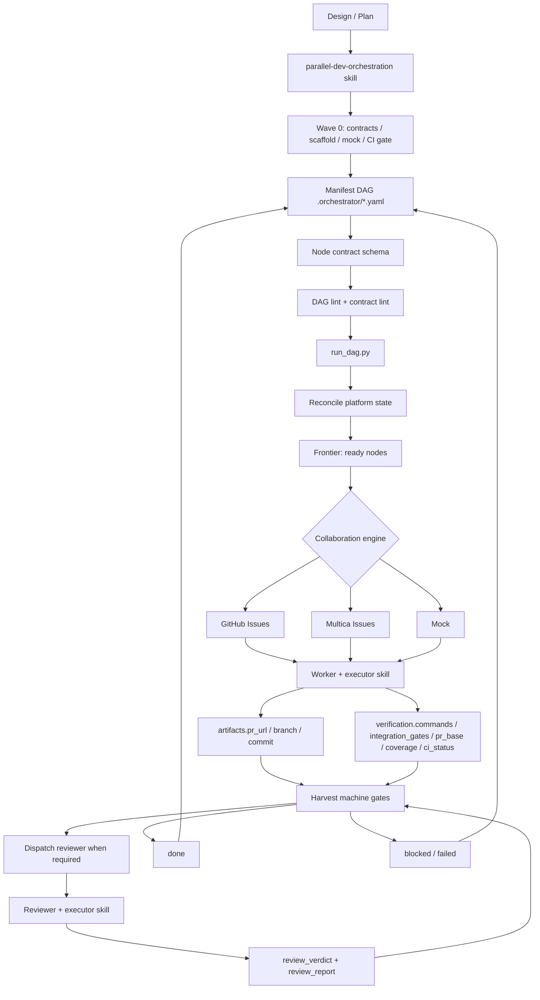

# parallel-dev-skills

把复杂开发计划变成可并行、可验收、可恢复的多 Agent 工程流水线。

`parallel-dev-skills` 是一套平台无关的 Agent Harness。它把复杂软件开发从
「一个 agent 靠长上下文硬扛」变成「契约先行 + manifest DAG + 多 Agent 并行执行 +
结构化证据 + reviewer 独立验收」的可收敛工程流程。

它解决的问题：

- Agent 长任务容易跑偏、忘上下文、提前宣布完成。
- 多 Agent 并行时接口漂移、重复造契约、集成地狱。
- worker 自述「已完成」，但缺少 PR、verification、coverage、review report 等客观证据。
- 任务状态靠聊天和人肉跟进，失败后难以断点续跑。
- GitHub、Multica、本地演示各自重写一套编排逻辑。

核心效果：

- 把一份设计或 plan 拆成可并行执行的 manifest DAG。
- 自动在 Mock / GitHub / Multica 中创建 work items 并按依赖派发 worker。
- 通过 manifest contract schema、lint、required contracts、acceptance、non-goals、
  verification commands、integration gates、PR base、coverage gate 把软约束变成硬合同。
- worker 必须交付 PR、结构化 artifacts、verification、integration gate evidence、coverage 证据。
- reviewer 必须交付结构化 verdict 和 review report，独立验收 diff、测试、集成测试、覆盖率和验收映射。
- 已完成节点可复用，失败节点可隔离，支持断点续跑和跨机器接力。

适合：

- 想用多个 coding agent 并行推进复杂 feature 的团队。
- 已有设计文档或 plan，希望拆成可派发、可验收任务的人。
- 使用 GitHub Issues 或 Multica issues 管理 agent 工作流的人。
- 想把 agentic engineering 从 vibe coding 升级到可治理流程的人。

不适合：

- 一次性小改动。
- 契约尚未摸清的探索性原型。
- 没有测试、CI、PR 习惯的项目。
- 只想要一个「更强 prompt」的场景。

---

## 1. 效果与价值：for human

### 它能实现什么

`parallel-dev-skills` 不是让一个 agent 更努力，而是在模型外部加一套工程控制系统：

1. 先把共享契约、骨架、mock、CI gate 打好，冻结并行开发的地基。
2. 把计划拆成 `.orchestrator/<name>.yaml` manifest DAG。
3. 通过固定引擎 lint、reconcile、frontier、dispatch、harvest。
4. worker 按 contract 交 PR 和结构化 verification。
5. reviewer 独立复跑并产出结构化 review report。
6. 引擎根据机器可读证据推进状态，而不是相信 prose 总结。

### 痛点对比

| 痛点 | 没有这套机制 | 使用这套机制 |
|---|---|---|
| 长任务跑偏 | agent 靠上下文硬记 | issue / manifest / AGENTS.md 外置约束 |
| 接口漂移 | 各自发明 DTO、事件、状态 | Wave 0 契约先行，required contracts 可 lint |
| 完成标准模糊 | worker 自述完成 | PR + verification + integration gate evidence + coverage gate + reviewer |
| 评审不可消费 | reviewer 写自然语言结论 | `review_verdict` + `review_report` 结构化输出 |
| 状态混乱 | 人肉跟进聊天记录 | manifest 状态机 + reconcile + harvest |
| 平台绑定 | 每个平台重写流程 | engine adapter 抽象：Mock / GitHub / Multica |

### 交付形态

本仓提供两个 skills 和一个可复制的运行护栏：

| 文件 | 谁使用 | 作用 |
|---|---|---|
| [`skills/parallel-dev-orchestration/SKILL.md`](./skills/parallel-dev-orchestration/SKILL.md) | 编排者 leader | 拆 DAG、写 manifest、跑引擎、处理失败、收尾 |
| [`skills/parallel-dev-executor/SKILL.md`](./skills/parallel-dev-executor/SKILL.md) | worker / reviewer | 执行、验证、产 PR、写结构化证据、独立评审 |
| [`AGENTS.md`](./AGENTS.md) | 业务项目中的常驻 agent 上下文 | 短、硬、可复制的通用运行护栏 |

README 只负责讲清价值、安装、最短使用路径和设计边界。完整 DAG 拆解方法论、worker/reviewer
执行协议、comment 模板和评审细则留在两个 skill 中。

---

## 2. 安装与使用：for agent

### 目录结构

```text
parallel-dev-skills/
├── README.md
├── AGENTS.md
├── LICENSE
├── scripts/
│   └── install.sh
└── skills/
    ├── parallel-dev-orchestration/
    │   ├── SKILL.md
    │   ├── .env.example
    │   └── scripts/
    │       ├── run_dag.py
    │       ├── setup.py
    │       ├── core/
    │       ├── engines/
    │       └── tests/
    └── parallel-dev-executor/
        └── SKILL.md
```

### 安装

```bash
git clone https://github.com/xiaohei-info/parallel-dev-skills.git
cd parallel-dev-skills

# 默认复制到 ~/.claude/skills
./scripts/install.sh

# 指定目标目录
./scripts/install.sh ~/.codex/skills

# 用软链安装，便于跟随仓库更新
./scripts/install.sh ./.claude/skills --link
```

也可以手动复制：

```bash
cp -R skills/parallel-dev-orchestration <your-agent-skills-dir>/
cp -R skills/parallel-dev-executor <your-agent-skills-dir>/
```

不同 Agent 的 skill 发现路径不同。Claude Code 通常使用 `~/.claude/skills/` 或项目内
`.claude/skills/`；Codex、OpenCode 等请使用各自的 skills 或 plugin 目录。安装脚本接受任意目标路径。

### 选择引擎

配置只放非敏感项。认证交给对应 CLI 自己管理，不要把 token 写进 `.env`。

| 引擎 | 用途 | 必需配置 | 认证 |
|---|---|---|---|
| Mock | 本地演示、CI、首次试跑 | `ENGINE_TYPE=mock`，可选 `MOCK_WORKSPACE_ID` | 无 |
| GitHub | 用 GitHub Issue 派发 work item | `ENGINE_TYPE=github`，`GITHUB_REPO=owner/repo` | `gh auth login` |
| Multica | 用 Multica issue 派发 work item | `ENGINE_TYPE=multica`，`MULTICA_WORKSPACE_ID`，可选 `MULTICA_SQUAD_ID` | `multica` CLI 登录 |

环境变量优先级：

```text
.env 文件 < 进程环境变量 export < 命令行参数 --engine / --workspace
```

各引擎前置准备：

加载本 skill 的 Agent 自己装不全外部依赖（CLI 登录、平台 id、成员池都在用户侧）。
**选定引擎后，按下表逐项引导用户完成**，每项缺失都会让真实编排卡住：

### Mock —— 零前置，先验证机制
- [ ] 无需任何外部依赖；`ENGINE_TYPE=mock` + 任意 `MOCK_WORKSPACE_ID` 即可。
- [ ] 不连真实平台、不真派 Agent，仅验证 lint→frontier→派发→状态机链路。
- 适用：第一次上手、CI、演示。**真实开发请切 github / multica。**

### GitHub —— issue 即 GitHub Issue
引导用户：
- [ ] **登录 `gh` CLI 管认证**：`gh auth login`（token 由 gh 自己保管，**不写进配置/.env**）。
- [ ] **确认目标仓库**：`GITHUB_REPO=owner/repo`，且账号对该仓有 **issue 读写权限**。
- [ ] **worker/reviewer 名 = 仓库可 assign 的 GitHub 用户名**——manifest 里写的名字必须是该仓能被指派 issue 的协作者/成员，否则派发失败。
- [ ] **确认集成分支存在**（manifest 的 `integration_branch`），PR 以它为 base。
- 配置：`ENGINE_TYPE=github` + `GITHUB_REPO=...`（`.env` / `export` / `--workspace owner/repo` 任一）

### Multica —— issue 即 Multica issue
引导用户：
- [ ] **登录 `multica` CLI 管认证**，确认 `multica` 在 PATH（认证存 `~/.multica`，**不写进配置/.env**）。
- [ ] **拿 workspace id**：`multica workspace list` → 填 `MULTICA_WORKSPACE_ID`。
- [ ] **拿 squad id**：`multica squad list`（或 `multica squad member list <squad-id>` 核对成员）。把它经 `setup.py` 填进 **`MULTICA_SQUAD_ID`（.env）**，作为默认派发小队——orchestrator 据此枚举成员、生成 manifest，无需先手编一个尚不存在的 manifest。各 manifest 的 `meta.squad` 为**可选覆盖**：写了则以 manifest 为准，没写就回退这个 env 默认值。
- [ ] **在小队里给每个 Agent 配好角色**：`worker` / `reviewer` / `architect`（编排者据此挑选——把擅长后端的 worker、专职评审的 reviewer 放到对应卡）。
- [ ] **确认成员池**：manifest 里每个 `worker:` / `reviewer:` 填的是 **agent 名**，且必须是该 squad 的真实成员；reviewer ≠ worker。

> **关于「为什么 manifest 里是 agent 名而不是 role」**：引擎按**名字**在 squad 成员池里校验与派发（`multica squad member list` 取成员名）。role 是**编排者选人的依据**——你按角色挑出合适的 agent，再把它的**名字**写进 `worker`/`reviewer` 字段。所以「在平台上配好角色」与「manifest 里写名字」二者配合：角色帮你选对人，名字是实际派发句柄。

- 配置：`ENGINE_TYPE=multica` + `MULTICA_WORKSPACE_ID=...`（`.env` / `export` / `--workspace <id>` 任一；`MULTICA_SQUAD_ID` 可选）

### id 用环境变量驱动（不必手改文件）

manifest 的字段支持 **`${ENV_VAR:-默认值}`** 展开。这样 squad / 仓库标识等 id 不必硬写进文件——
用户设环境变量即可，未设则用默认值（mock 下开箱即跑）：

```yaml
meta:
  squad: "${ORCH_SQUAD:-mock-workspace}"   # 真实运行：export ORCH_SQUAD=<你的squad>
```

配置入口：

```bash
cd <skills-dir>/parallel-dev-orchestration

# 交互式生成 .env
python3 scripts/setup.py

# 或复制示例后手填
cp .env.example .env

# 或不用 .env，直接传命令行参数
python3 scripts/run_dag.py .orchestrator/demo.yaml --engine multica --workspace <workspace-id>
```

### 快速开始：Mock 空跑

第一次建议用 Mock 跑通机制，不连接真实平台。

```bash
cd <skills-dir>/parallel-dev-orchestration

printf 'ENGINE_TYPE=mock\nMOCK_WORKSPACE_ID=mock-workspace\n' > .env
python3 scripts/run_dag.py --help

cp scripts/tests/smoke_test_manifest.yaml /tmp/demo.yaml
python3 scripts/run_dag.py /tmp/demo.yaml
```

引擎会执行 lint、reconcile、work item 创建、frontier 计算、dispatch、harvest，并把状态写回
manifest。Mock 引擎预置成员 `alice`、`bob`、`charlie`，冒烟样例可直接跑。

注意：manifest 文件本身会被改写，所以 demo 使用 `/tmp/demo.yaml`。真实跨机器协作时再把
manifest 放在业务项目 `.orchestrator/` 下，并按需开启 git 回写。

### 真实项目使用

高层路径如下，协作细节见 skill 正文：

1. 让 orchestrator agent 加载 `parallel-dev-orchestration`。
2. 做 Wave 0：共享契约、项目骨架、mock/fake、CI gate。
3. 生成 `.orchestrator/<name>.yaml`，每个节点声明 worker、reviewer、依赖和 contract。
4. 让 manifest 过 PR 或人工评审门。
5. 运行 `python3 scripts/run_dag.py .orchestrator/<name>.yaml`。
6. 被派发的 worker / reviewer 加载 `parallel-dev-executor`。
7. worker 交 PR、artifacts、verification；reviewer 交 verdict、review report。
8. 编排者看 manifest、issues、PR、verification digest 收尾。

相关入口：

- DAG 怎么拆：[`parallel-dev-orchestration`](./skills/parallel-dev-orchestration/SKILL.md)
- worker/reviewer 怎么执行：[`parallel-dev-executor`](./skills/parallel-dev-executor/SKILL.md)
- 常驻护栏怎么放：[`AGENTS.md`](./AGENTS.md)

### Manifest contract 最小示例

新任务建议给每个节点写 `contract`。旧 manifest 仍可运行；没有 `contract` 的节点按 legacy
规则处理。一旦声明 `contract`，lint 和 harvest 会启用硬门禁。

```yaml
nodes:
  - id: user-api
    title: Implement user API
    worker: backend-agent
    reviewer: review-agent
    blocked_by: [shared-contracts]
    contract:
      objective: 实现用户查询 API
      source_of_truth:
        - docs/design.md#user-api
      required_contracts:
        - shared/contracts/user.py
      acceptance:
        - GET /users/:id returns 200 for existing users
        - GET /users/:id returns 404 for missing users
      non_goals:
        - Do not modify auth flow
      verification_commands:
        - pytest tests/user_api --cov=app.user --cov-branch --cov-report=xml
        - diff-cover coverage.xml --compare-branch=feature/v1 --fail-under=90
      integration_gates:
        - name: user-api-contract
          layer: L1 API contract
          source_of_truth:
            - docs/design.md#user-api
          delivery_goal: User API returns documented envelopes and problem+json errors
          covers:
            - route_contract
          acceptance_refs:
            - GET /users/:id returns 200 for existing users
            - GET /users/:id returns 404 for missing users
          commands:
            - pytest tests/integration/user_api
          required_metrics:
            route_contract_coverage: 100
          artifacts:
            - coverage.xml
      pr_base: feature/v1
      coverage_gate: 90
```

lint 口径：

- `objective` 必填。
- `acceptance`、`non_goals`、`verification_commands`、`integration_gates` 必填且非空；每个 integration gate 必须锚定 `source_of_truth`、`delivery_goal`、`covers`、`acceptance_refs` 和 `commands`。
- `pr_base` 必填，避免 PR 打到错误基线。
- `coverage_gate` 缺省 90，填写时必须是 0 到 100。
- `required_contracts` 中的仓库路径必须存在。
- reviewer 存在时必须不同于 worker。

harvest 口径：

- worker 必须写 `artifacts.pr_url`。
- `verification.commands` 必须覆盖 contract 中声明的 `verification_commands`。
- `verification.integration_gates` 必须逐项覆盖 contract 中声明的 `integration_gates`。
- 所有 command / integration gate command `exit_code` 必须为 0，gate metrics/artifacts 必须满足声明。
- `verification.pr_base` 必须等于 `contract.pr_base`。
- `verification.coverage` 必须达到 `coverage_gate`。
- 有 reviewer 时，`review_verdict` 必须是 `pass` 或 `pass-with-nits`，且 `review_report`
  满足 diff、tests、integration tests、coverage、acceptance mapping、integration gate mapping、blockers 等结构化检查。

### AGENTS.md 的采用

[`AGENTS.md`](./AGENTS.md) 是可复制到业务项目根目录的运行护栏。它只放每次加载后都该看见的高频硬规则：

- 契约先行，且契约以代码存在。
- 只消费共享契约，不平行重定义。
- 先规划后实现，测试同步，完成必须有证据。
- reviewer 独立复跑测试、看真实 diff、只读共享态。
- PR base 指向集成分支，不直接打到主干。

推荐做法：

1. 已有业务项目 `AGENTS.md` / `CLAUDE.md`：把本仓护栏合并进去，与业务专属规则并列。
2. 没有运行护栏：直接复制本仓 `AGENTS.md` 作为起点。
3. 只需要引用：在业务项目护栏顶部放一行指针，项目规则仍写在业务项目自己的文件里。

不要把安装步骤、完整方法论、worker/reviewer 长协议放进业务项目 `AGENTS.md`。常驻上下文越短，越不容易稀释注意力。

### 前置依赖与测试

- Python >= 3.9。
- PyYAML。
- GitHub 引擎需要已登录的 `gh` CLI。
- Multica 引擎需要已登录的 `multica` CLI。
- Mock 引擎无外部平台依赖。

安装 PyYAML：

```bash
python3 -m pip install pyyaml
```

运行编排引擎测试：

```bash
cd skills/parallel-dev-orchestration/scripts
python3 -m pytest tests/ -q
python3 -m pytest tests/ -q -m "not live_multica"
```

live Multica 测试默认 skip。只有 `multica` CLI 在 PATH，且显式设置 `MULTICA_WORKSPACE_ID`
和 `MULTICA_TEST_SQUAD` 时才会运行。

---

## 3. 机制与设计：for dev

### Agent = Model + Harness

本项目不增强模型本身，而是补齐模型外部的工程控制层：

- context 外置：issue body、manifest、contract、AGENTS.md、skill 分层承载上下文。
- 任务拆解：leader 将 plan 转成可 lint 的 manifest DAG。
- 状态持久化：manifest 记录节点状态和 work item id，支持幂等重跑。
- 平台适配：Mock、GitHub、Multica 共享同一套 engine 抽象。
- 验证闭环：worker 输出结构化 artifacts / verification，reviewer 输出结构化 verdict / report。
- 机器门禁：harvest 阶段消费结构化证据，决定 done、in_review、blocked。

### Harness 四象限映射

本仓按 Harness 四象限补强并行开发，而不是只堆 prompt。

| 象限 | 项目组件 | 作用 |
|---|---|---|
| Guide x Inferential | `AGENTS.md` 瘦身、orchestration skill、executor skill、常驻护栏分层 | 行动前软约束。把高频铁律放在短上下文里，把长方法论留在 skill 中，降低注意力噪音 |
| Guide x Computational | manifest contract schema、DAG lint、required contracts、acceptance、non-goals、verification commands、integration gates、PR base、coverage gate | 行动前硬约束。非法 DAG、缺失合同、错误 agent、错误 PR base、缺失 required contracts、缺失集成门在执行前失败 |
| Sensor x Computational | 结构化 artifacts、verification、integration gate evidence、PR、CI、coverage gate、harvest 机器门禁 | 行动后机器检查。worker 自述不算完成，必须有 PR、单测命令结果、集成门证据、coverage、base branch 等可消费证据 |
| Sensor x Inferential | 结构化 reviewer report、review verdict、acceptance mapping、integration gate mapping、blockers、nits | 行动后语义检查。reviewer 对照 diff、单测、集成测试、覆盖率和验收条目做独立判断，报告能被引擎消费 |

这对应 AITEAM-193 的落地方案：先把 contract 字段和 lint 硬化，再把 worker/reviewer 产物升级成结构化 metadata，最后让 harvest 阶段用这些证据推进状态。

### 组件架构图



### 状态机

```text
todo -> in_progress -> in_review -> done
                  \-> blocked / failed
```

核心动作：

- `lint`：执行前校验 DAG、成员池、依赖、contract 字段和 required contract 路径。
- `reconcile`：用 manifest 中的 `work_item_id` 读取平台真实状态，同步回 manifest。
- `frontier`：找出依赖已完成的 ready nodes。
- `dispatch`：创建或认领 work item，派发 worker。
- `harvest`：收割 worker/reviewer 的结构化证据，执行机器门禁。
- `blocked`：失败节点隔离下游，独立分支继续推进。
- `rerun`：对同一 manifest 重跑，已完成节点跳过，失败节点可调整后重试。

### 为什么这套设计先进

- 不是单 agent 长上下文硬扛，而是把上下文、状态、合同和证据放到模型外部。
- 不是临时 prompt，而是可安装、可复用、可版本化的 skills。
- 不是平台绑定，而是通过 engine adapter 适配 Mock、GitHub、Multica。
- 不是 worker 自证完成，而是 PR、verification、integration gate evidence、coverage、reviewer report 多层证据闭环。
- 不是只靠 LLM 语义判断，而是把 Guide / Sensor、Inferential / Computational 四象限都补齐。
- 不是一次性调度脚本，而是可 lint、可 harvest、可 reconcile、可断点续跑的状态机。

### 组件边界

| 组件 | 负责 | 不负责 |
|---|---|---|
| README | 价值、安装、最短路径、架构解释 | 复述完整 worker/reviewer 协议 |
| `AGENTS.md` | 常驻高频护栏 | 安装说明、平台配置、长方法论 |
| orchestration skill | DAG 拆解、manifest、编排器用法、失败处理 | worker 具体实现步骤 |
| executor skill | worker/reviewer/architect 执行协议、结构化证据格式 | leader 如何拆完整 DAG |
| `run_dag.py` | lint、reconcile、dispatch、harvest、状态回写 | 替业务项目写测试或替 reviewer 做语义判断 |
| engine adapters | 平台 work item 创建、读取、状态/metadata 映射 | 改变 manifest 语义 |

### 开发入口

主要代码在 `skills/parallel-dev-orchestration/scripts/`：

- `run_dag.py`：编排入口。
- `core/manifest.py`：manifest 数据模型、contract 字段、YAML load/save。
- `core/lint.py`：DAG 和 contract lint。
- `core/evidence.py`：artifacts、verification、review report 校验。
- `core/graph.py`：frontier、依赖、失败隔离。
- `engines/`：Mock / GitHub / Multica adapters。
- `tests/`：manifest、lint、evidence、engine、harvest gates、幂等重跑测试。

---

## License

[MIT](./LICENSE)
