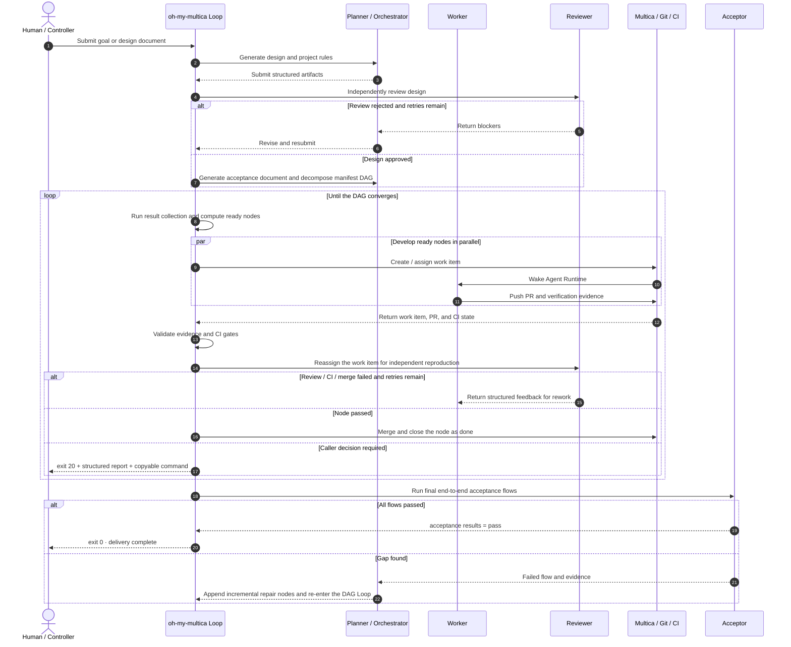

# oh-my-multica

[](https://github.com/xiaohei-info/oh-my-multica/actions/workflows/ci.yml)
[](https://github.com/xiaohei-info/oh-my-multica/releases/tag/v1.0.0)
[](./LICENSE)

[English](README.md) | [简体中文](README.zh-CN.md)

**构建在 [Multica](https://github.com/multica-ai/multica) 之上的生产级 AI 软件交付系统。**

[Multica](https://github.com/multica-ai/multica) 把 Claude Code、Codex 等 Coding Agent 统一接入
工作空间、issue、任务队列和本地 runtime。Agent 可以像团队成员一样接受任务、报告进度和阻塞，
团队也可以统一管理运行机器与可复用 Skill。它为多 Agent 协作解决了任务分配、生命周期、运行时
调度和状态追踪等基础问题。

Multica 更多关注的是 Agent 的执行与协作，但不会替软件项目定义完整的工程交付过程，例如需求怎样进入设计、
如何形成可执行验收标准、多个开发任务如何按依赖并行、什么证据足以证明实现正确、谁来独立评审，
以及何时允许合并和如何从失败中恢复。

oh-my-multica 基于 Multica 优秀的机制设计，在其之上实现了更加完整的软件工程交付控制层，
把一个需求推进为经过设计、开发、验证、评审、合并和最终验收的软件变更。

**Multica 作为一套完整的 Agent Runtime 任务平台管理 Agent 如何工作，
而 oh-my-multica 在其之上管理软件如何完成交付。**

## 为什么需要 oh-my-multica

Coding Agent 已经很会写代码。困难通常出现在代码之外：需求在长对话中逐渐漂移，多个 Agent
修改了相互冲突的部分，测试结果只存在于一段自述中，评审者相信作者的总结，或者一个运行数小时
的循环悄悄停止，却没有留下可继续执行的状态。

增加 Agent 数量不会自动解决这些问题，反而有可能让事情越来越复杂和难以控制。

oh-my-multica 要解决的核心问题是：**如何让多个 Coding Agent 在尽量少的人工介入下，
把一个需求完整地设计、实现并交付为生产级软件系统，而不是停留在代码生成、原型或 Demo，并很认真的告诉你已经完成所有功能可以交付。**

> **oh-my-multica 把生产级复杂软件交付的组织门槛降到最低。** 当目标和验收标准明确后，
> 设计、拆解、开发、验证、评审和验收都可以交给可扩展的 Agent Team。影响交付吞吐量的主要资源
> 变成两项：机器数量决定 Agent 的开发并发度，Token 预算决定可以投入多少推理、实现、复测和返工。

## oh-my-multica 在 Multica 之上增加了什么

| 机制         | oh-my-multica 的做法                                                                          | 解决的问题                           |
| ------------ | --------------------------------------------------------------------------------------------- | ------------------------------------ |
| 确定性控制流 | 交付主循环，规划、开发、评审和验收 Agent 都是有终点的任务执行者                               | 防止监督 Agent 跑偏、遗忘或提前退出  |
| 计划流水线   | Agent 动态产出设计方案 → 验收文档 → manifest DAG，阶段之间有 machine gate 和 review gate    | 防止需求、设计、拆解和实现各说各话   |
| 可验证 DAG   | Agent 动态规划节点与并行链路，每个节点都有依赖、owner、reviewer、acceptance、验证命令和集成门 | 让并行建立在边界上，而不是碰运气     |
| 独立质量裁决 | worker 不自审自放行；reviewer 独立复跑；acceptor 按 flow 做最终验收                           | 避免把作者自述当成事实               |
| 结构化证据   | verification、review report、acceptance results 都有 schema 和提交门                          | 让“通过”可以被程序检查和后续追溯   |
| 交付收口     | 可配置 CI、PR 合并和总控验收；失败回到有界返工                                                | 避免把“代码写完”误认为“已经交付” |
| 持久化与恢复 | 状态保存在 manifest 与平台；重跑先 reconcile；失败返回 exit 20                                | 中断后继续，而不是重新提示一遍       |

### 与多 Agent 协作开发产品有什么不同

| 方案                                                                                                                                    | 协作方式                                                                                                                                                                  | 主要解决的问题                                                                                                                        | 应用场景                                                                                        |
| --------------------------------------------------------------------------------------------------------------------------------------- | ------------------------------------------------------------------------------------------------------------------------------------------------------------------------- | ------------------------------------------------------------------------------------------------------------------------------------- | ----------------------------------------------------------------------------------------------- |
| [Codex App](https://openai.com/index/introducing-the-codex-app/) / [Claude Code Agent Teams](https://code.claude.com/docs/en/agent-teams) | Human 或 lead Agent 拆分任务，协调多个 session、thread 或 worktree，并持续决定下一步                                                                                      | 并行开发、上下文隔离和交互式任务分工                                                                                                  | 任务已经拆清楚，开发者愿意持续监督、协调和整合结果                                              |
| [Claude Code Dynamic Workflows](https://code.claude.com/docs/en/workflows)                                                               | Claude 根据当前任务动态生成可重放的编排脚本，runtime 执行其中的循环、分支和并行 subagent                                                                                  | 把大规模审计、迁移、研究和重复验证编排成一次可执行的多 Agent 工作流                                                                   | 单次任务需要几十到数百个 Agent，或同一套编排需要保存和复用                                      |
| [Factory Missions](https://docs.factory.ai/features/missions/overview)                                                                   | Droid 与用户共同规划 feature、milestone 和成功标准；Agent Orchestrator 持有 Mission 循环，动态调度、重规划和恢复                                                          | 让 Agent 自主推进大型、多功能、长时间运行的开发 Mission                                                                               | 仓库具有较高 Agent Readiness 和可脚本化用户 QA，Human 愿意以项目经理方式监督 Agent Orchestrator |
| [OpenAI Symphony](https://openai.com/index/open-source-codex-orchestration-symphony/)                                                    | issue tracker 保存任务状态，后台服务为每个 issue 创建独立 workspace，并持续调度或重启 Coding Agent                                                                        | 消除人工维护大量 Coding Agent session 的负担                                                                                          | 已有成熟 backlog、自动化测试和仓库 Harness，通过 issue 持续推进开发的团队                       |
| [MetaGPT](https://github.com/FoundationAgents/MetaGPT)                                                                                   | 产品经理、架构师、项目经理和工程师等 LLM 角色按照 SOP 交换软件产物                                                                                                        | 把自然语言需求转化为用户故事、设计、API、文档和代码仓库                                                                               | 绿地生成、多 Agent 工作流研究，以及愿意自行补充完整交付链路的项目                               |
| **oh-my-multica**                                                                                                                 | **Planner 和 Orchestrator Agent 根据当前需求动态规划交付链路并生成 contract-driven manifest DAG；确定性 Loop 按依赖派发任务、回收证据、执行质量门并推进到最终验收** | **让复杂软件交付既能动态规划，又能确定性推进和收敛；安全扩大高性价比 Agent 的开发并发，而不把整个项目的完成判断交给监督 Agent** | **需要以较少人工介入并行交付复杂功能、多模块系统或生产级软件服务**                        |

与其他多 Agent 协作产品相比，最重要的区别不是有没有规划、并行开发或自动验证，而是**谁掌握整个执行循环**。
Factory Missions 同样有结构化计划、Validator Worker 和重试上界，但下一步调度、重新规划和异常恢复
主要由 Agent Orchestrator 判断，Human 通过对话观察、暂停和纠偏。这给 Mission 很强的临场适应能力，
同时也意味着循环结果更依赖 Orchestrator 当前的上下文、推理质量和 Human 监督。

oh-my-multica 把不确定性、能够高度自由发挥的大模型能力留在真正需要推理的地方：Agent 负责理解需求、设计方案、定义验收、规划 DAG
和完成节点任务；一旦规划产物通过 schema、lint 和独立 review，循环控制权就交给确定性程序。
节点依赖、运行状态、证据门、返工上界、合并条件、恢复入口和停止条件，不由监督 Agent 临场决定和发挥。

带来的变化是 oh-my-multica 在不损失自主 Agent 规划和执行的基础上，拥有更强、更稳定的控制流和机制保障，Token 开销更小、单位 Token 效率更高。

**动态规划，确定性执行。** Planner 先根据当前
项目形成设计方案与验收定义，Orchestrator 再按真实架构边界规划 Wave 0 地基、Wave 1 并行 track
和 Wave 2 集成验收，并为每个节点声明 contract、依赖、Worker、Reviewer、验证命令和集成门：

```text
Requirement → Agent-authored design / acceptance / DAG → schema + lint + review → deterministic Loop → development / review / merge / final acceptance
```

这与 Claude Code Dynamic Workflows 的分工有相似之处：都是由 Agent 针对当前任务规划编排，再由
runtime 执行确定性流程。区别在于，Claude Code Workflow 产出的是面向某次任务的可执行编排脚本；
oh-my-multica 产出的是面向生产软件交付的版本化 DAG，它不仅描述“接下来运行什么”，还定义每个
交付节点“允许做什么、如何验证、由谁评审，以及什么证据足以继续推进”。

在这套结构下，高能力模型可以集中处理设计、规划和质量判断，高性价比模型承担数量最多、Token
消耗最大的开发与测试节点。Harness Engineering 提供行动前约束与行动后反馈，未通过 contract、
验证、评审或最终验收的结果会进入返工，不能进入交付链。

### 一次真实的端到端交付

[Webhook Inbox demo](https://github.com/xiaohei-info/oh-my-multica-demo-webhook-inbox) 从一个带有生产约束的
目标开始，通过动态规划出的五节点 DAG 和五个合并 PR 完成收敛。集成结果通过 86 个测试，覆盖率
97.18%，CI 覆盖 Python 3.10 至 3.13，同时通过非 root 容器验证、独立评审和最终验收。

第一轮最终验收只有 2/11 flows 通过，因为经过评审的验收源仍然启动了已经过期的应用入口。Loop
保留失败证据并拒绝完成；修正验收源后，完整验收 11/11 通过，控制器返回 exit 0。阅读
[端到端案例](docs/case-studies/webhook-inbox-end-to-end.zh-CN.md)，查看 DAG、角色分工、公开 PR 和失败证据。

## 适合谁

- 已经重度使用 AI Coding，希望从亲自盯住每一次对话，转向管理目标、约束和结果的开发者。
- 希望用尽量少的人工接力，持续产出可部署、可维护软件服务的个人、创业团队和工程团队。
- 编程经验有限，但愿意把目标和验收结果说清楚，希望 Agent 按完整架构设计与实施流程完成项目的人。
- 需要同时使用多个 Agent 或多台运行机器，又不希望任务状态散落在终端、聊天记录和个人记忆中的团队。

oh-my-multica 不适合一次性的代码片段生成，也不会替代业务决策。它最有价值的场景，是任务足够复杂、
交付质量值得被明确验证，并且你希望把重复监督交给系统。

## 如何开始

> 前置条件：oh-my-multica 必须运行在已经初始化 Git 并配置了可推送远程仓库的
> 项目中。请从目标项目的仓库根目录启动；使用 Multica engine 时，配置与 manifest 默认通过
> `origin/main` 同步，执行 Agent 通过分支、Pull Request 和合并完成交付。

### 安装

前置条件：

- Python 3.10 或更高版本。
- 目标项目已经初始化 Git、至少存在一次提交，并配置了可推送的 `origin` 远程仓库；
  使用 Multica engine 时默认通过 `origin/main` 同步 oh-my-multica 状态。
- 使用 `pipx` 隔离安装 oh-my-multica 的 `omac` CLI。
- 使用 Multica engine 时，[安装 Multica CLI](https://github.com/multica-ai/multica/blob/main/CLI_INSTALL.md) 并完成 `multica login`将电脑/机器上的 Codex、Claude Code 等 Runtime 接入 Multica。

```bash
pipx install git+https://github.com/xiaohei-info/oh-my-multica.git@v1.0.0

omac --version
```

当前稳定安装源是带版本号的 GitHub Tag。如需安装最新开发版本，将命令中的 `@v1.0.0`
替换为 `@main`。

接入 Multica 的机器越多、你能够获得的 Agent 执行并行度就越大，装了 Coding Agent Runtime 的机器是这套机制最底层的任务执行地点。

### For Human

只需要关注三件事：配置可用的 Agent 团队、描述目标、处理系统无法替你决定的问题。

```bash
omac init
omac plan create --name <feature> --goal "<你希望交付的结果>"
```

`plan create` 会让 Planner 和 Orchestrator Agent 围绕当前需求依次形成设计方案、验收文档和动态
规划的 manifest DAG，而不是套用一张固定任务模板。规划通过后，直接执行输出中的“下一步”命令，
让确定性 Loop 接管开发与交付。你可以通过平台 issue 或 `omac web` 查看进度。

### For Agent

请先执行命令查看 guide 指引：

```bash
omac guide workflow
```

在目标项目的仓库根目录中工作：

1. 先运行 `omac init --check`。配置缺失时，按照错误输出完成声明式配置，不调用人类交互向导。
2. 根据用户目标创建新计划，或接续已经存在的 manifest。
3. 执行命令输出中给出的精确“下一步”，不要猜 manifest 路径、命令参数或当前阶段。
4. 保持 `dag run` 在前台运行，直到返回 exit 0 或 exit 20。
5. 只有 exit 0 且 manifest 已收敛时才能报告交付完成。exit 20 时加载 `omac guide recovery`；
   需要改变目标、范围或风险接受程度时，把决定交还给 Human。

## Agent Team 配置最佳实践

oh-my-multica 在 [`src/omac/agents/`](./src/omac/agents) 中提供了 planner、orchestrator、worker、
reviewer、acceptor，以及 architect、backend、frontend、pm 等内置模板。你可以直接使用这些模板，
也可以借鉴其中的 Instructions、职责边界和 Skill 配置来组建自己的 Agent Team。

不需要给所有角色都使用最昂贵的模型。更合理的做法是按照决策影响、任务风险和 Token 消耗分配模型：

| 任务类型   | 典型角色                             | 推荐模型                                                 | 配置理由                                                                                                                                                            |
| ---------- | ------------------------------------ | -------------------------------------------------------- | ------------------------------------------------------------------------------------------------------------------------------------------------------------------- |
| 设计与规划 | planner、architect、orchestrator     | GPT、Claude 的旗舰模型，或性能相当的其他第一梯队模型     | 调用次数相对少，但设计和拆解错误会被所有下游任务放大                                                                                                                |
| 评审与验收 | reviewer、acceptor                   | GPT、Claude 的次级旗舰模型，或性能相当的其他第二梯队模型 | 保持独立判断和评审质量，同时控制复跑与验收成本                                                                                                                      |
| 开发与测试 | worker、backend、frontend 等执行角色 | 高性价比商业模型、成熟开源模型或其他第三梯队模型         | 任务数量、并发度和 Token 消耗最大，清晰 contract 与验证门可以约束执行结果，**不用担心低性能模型会交付不符合预期或者超出边界的结果！这正是我们要解决的问题！** |

## 核心设计：Loop Engineering × Harness Engineering

**oh-my-multica 是 Loop Engineering 与 Harness Engineering 在生产级软件交付场景中的工程化实现。**
Loop 负责持续读取事实、消费反馈、推进工作，并判断下一步与停止条件；Harness 负责把目标、上下文、
工具、约束、验证和评审编码成每一轮执行都必须遵守的环境。

### Loop Engineering：把反馈、执行与完成条件连接成闭环

[Anthropic《Building Effective Agents》](https://www.anthropic.com/engineering/building-effective-agents)
将 Agent 描述为：LLM 根据环境反馈反复使用工具，每一步都从环境获取事实，再决定继续执行、纠正、
请求人工判断或在满足停止条件时结束。Anthropic 同时区分了 workflow 与 agent：前者由程序预先定义
执行路径，后者由模型动态决定如何完成任务。在
[Claude Agent SDK 的官方实践](https://www.anthropic.com/engineering/building-agents-with-the-claude-agent-sdk)中，
这条反馈循环被进一步概括为 **gather context → take action → verify work → repeat**。

[OpenAI 的 Agent Improvement Loop](https://developers.openai.com/cookbook/examples/agents_sdk/agent_improvement_loop)
进一步把 traces、反馈、评测、Harness 调整、实现和再验证连接成一个可运行的改进循环；
[OpenAI 的 Harness Engineering 实践](https://openai.com/index/harness-engineering/)则把大型目标拆成设计、
开发、评审和测试等边界清晰的工作单元，并让反馈持续返回执行过程，直到验证与评审真正通过。

这些实践的共同点不是让 Agent “多跑几次”，而是构造一个能够持续完成
**观察事实 → 决定下一步 → 执行动作 → 验证结果 → 消费反馈 → 判断是否结束**的闭环。

按照 Anthropic 的分类，oh-my-multica 的外层控制面是确定性 workflow，DAG 节点内部才是自主 agent。
这是有意的混合设计：模型负责设计、拆解、编码、评审和验收等需要推理的任务；程序负责保存状态、
计算依赖、控制并发、执行质量门和决定整个交付是否收敛。确定性控制并不意味着使用固定流程模板：
Agent 会根据当前仓库、设计方案和验收定义动态规划 DAG；程序在规划通过后接管循环控制。

```text
reconcile → result collection (collect_results) → evidence and delivery gates → ready nodes → dispatch → converged / exit 20
```

| Loop Engineering 要素  | oh-my-multica 的落地                                                                                                            |
| ---------------------- | ------------------------------------------------------------------------------------------------------------------------------- |
| 从环境读取事实         | `reconcile` 对齐 manifest 与平台工单；Git、结构化 evidence、review report，以及按配置启用的 Pull Request 和 CI 都是可检查事实 |
| 把目标拆成可推进的小步 | Agent 根据设计、验收和当前仓库动态规划 Wave 0 / 1 / 2 与节点 contract；程序再按真实依赖和`max_parallel` 计算 ready nodes      |
| 在边界内自主执行       | 每个 Agent 只收到当前节点的 task、context、contract、authority 和最小`guide_refs`，自行决定节点内部如何完成                   |
| 根据反馈纠正           | `collect_results` 消费验证、CI、Reviewer 与 merge 结果；失败进入有界返工，无法自动处理的失败进入显式恢复                      |
| 跨会话持续运行         | 状态持久化在 manifest、平台与 Git 中；新的 Human 或 Controller Agent 可以从同一事实继续，而不依赖上一轮上下文记忆               |
| 明确停止条件           | 仍有运行节点就继续；需要决策时返回 exit 20；所有节点收敛并通过最终验收后才返回 exit 0                                           |

OpenAI 的 Agent Improvement Loop 主要描述持续改进 Agent 与 Harness 的“外循环”；oh-my-multica
当前直接落地的是生产软件交付的“内循环”：每轮都把执行结果变成证据和反馈，再决定推进、返工、
停止或请求决策。Loop 不靠某个监督 Agent “记得继续”，也不会因为上下文重置而失去交付状态。

### Harness Engineering：把工程判断编码进环境

仅有循环还不够。一个错误目标可以被循环执行得又快又稳定。Harness Engineering 关注模型之外的
整个工作环境：知识如何提供、架构如何约束、结果如何验证、错误如何反馈、状态如何保存。
[Anthropic 关于长期运行 Agent Harness 的实践](https://www.anthropic.com/engineering/effective-harnesses-for-long-running-agents)
强调增量推进、持久化工程产物以及跨上下文恢复；OpenAI 则强调把仓库建设成 Agent 可读的事实系统，
并将测试、验证、评审、反馈和恢复机制编码进环境，而不是依赖提示词或人工盯守。

[Harness Engineering](https://martinfowler.com/articles/harness-engineering.html) 可以从两个维度理解：
Guide 在 Agent 行动前提供前馈约束，Sensor 在行动后提供反馈；Computational 依靠确定性程序判断，
Inferential 依靠模型完成语义分析。成熟 Harness 通常会组合使用四个象限，并由一个可信的 Loop
消费这些信号，决定继续、返工、停止或请求人工决策。


oh-my-multica 把上述 Loop 与 Harness 原则落实为围绕生产软件交付的 CLI 协议、状态机和证据模型：

Harness 产生前馈约束与反馈信号，确定性 Loop 消费这些信号并推进状态，Agent 则在明确边界内完成
最适合模型处理的推理和执行工作。

## 整体架构

oh-my-multica 不替代 Multica，也不替代 Coding Agent。它位于调用者与执行平台之间，负责把软件工程事实
转换成可执行状态，再通过统一接口使用 Multica 的任务与运行时能力。


## 从需求到交付

下面的泳道展示标准路径。设计、验收、拆解和开发都可以发生有界返工；系统只有在证据满足合同后
才推进状态。无法自动处理的失败不会被吞掉，而是以 exit 20 和下一步命令交还调用者。



## “面向生产级”具体意味着什么

oh-my-multica 不承诺任何 Agent 生成的代码天然可以上线。生产质量取决于需求是否正确、合同是否完整、
验证命令是否有效、CI 是否配置，以及 reviewer 和 acceptor 是否具备足够能力。

oh-my-multica 提供的保证更务实：这些关键条件会成为流程中的显式事实和检查点，而不是藏在人脑或聊天记录里。

| 生产交付要求           | oh-my-multica 中的落点                                                 |
| ---------------------- | ---------------------------------------------------------------------- |
| 需求不漂移             | design problem / non-goals / flows 与 acceptance flow id               |
| 架构可维护             | 核心数据所有权、模块边界、跨模块契约、项目级`AGENTS.md`              |
| 改动不破坏既有行为     | contract 的 source of truth、non-goals、integration gates 与兼容性要求 |
| 结果可以复现           | verification commands、env setup、结构化 evidence                      |
| 作者不能自证正确       | worker 与 reviewer 分离，最终由 acceptor 按用户旅程验收                |
| 代码真正进入交付链     | PR、CI、merge 与 final acceptance 可纳入完成条件                       |
| 长任务可以中断续跑     | manifest / work item 持久化、幂等 tick、reconcile                      |
| 自动化不能越权替人决定 | 有界返工；超出边界统一 exit 20                                         |

## 参与贡献

使用 [GitHub Discussions](https://github.com/xiaohei-info/oh-my-multica/discussions) 提问、交流想法和分享
交付案例；使用 Issue 报告可复现缺陷或提出边界清晰的功能需求。开发与验证要求见
[CONTRIBUTING.md](CONTRIBUTING.md)，获取帮助见 [SUPPORT.md](SUPPORT.md)，社区行为规范见
[CODE_OF_CONDUCT.md](CODE_OF_CONDUCT.md)，私密安全问题报告方式见 [SECURITY.md](SECURITY.md)。

## License

[MIT](./LICENSE)
