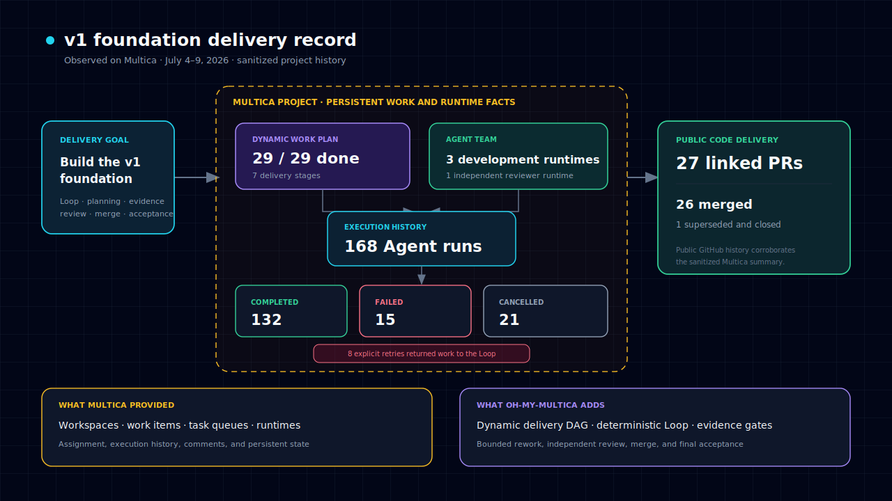

# 在 Multica 上构建 v1 基础

oh-my-multica 最早的一份真实案例，就是它自己的早期工程记录。2026 年 7 月 4 日至 7 月 9 日，
一个 Multica 项目推进了 v1 基础建设：确定性 Loop、规划流水线、任务合同、证据门、独立评审交接、
CI 与合并闭环、最终验收和本地 Web 视图。

这里必须先讲清楚边界：完整的 oh-my-multica 控制层不可能回到过去编排自己的全部开发过程。
这份案例记录的是 Multica 如何支撑项目基础建设，以及这段协作暴露出哪些问题，最终促成了
oh-my-multica 的交付控制层。公开 Pull Request 可以核验代码变更；脱敏后的 Multica 汇总数据
记录了执行过程。

## 交付记录

| 事实 | 实际结果 |
| --- | ---: |
| 执行时间窗口 | 4 天 20 小时 41 分钟 |
| 工作项 | 共 29 个，29 个完成 |
| 交付阶段 | 7 个 |
| Agent Runtime | 3 个开发 Runtime，1 个独立评审 Runtime |
| Agent 执行次数 | 168 |
| 完成的执行 | 132 |
| 失败的执行 | 15 |
| 取消的执行 | 21 |
| 重试次数 | 8 |
| Pull Request | 关联 27 个；合并 26 个；1 个被替代后关闭 |

脱敏后的原始汇总数据保存在
[`data/v1-foundation-summary.json`](data/v1-foundation-summary.json)。公开 GitHub 历史中可以看到：
[PR #1](https://github.com/xiaohei-info/oh-my-multica/pull/1) 建立了最初的 CI，
[PR #6](https://github.com/xiaohei-info/oh-my-multica/pull/6) 实现确定性 Loop，
[PR #29](https://github.com/xiaohei-info/oh-my-multica/pull/29) 完成交付级端到端闭环，
[PR #37](https://github.com/xiaohei-info/oh-my-multica/pull/37) 则完成了后续元数据收敛。

## 工作是如何拆开的

项目从一个 EPIC 和分阶段交付计划开始。前面的节点先建设 Loop、项目初始化、CI、任务元数据和
证据 Schema；中间阶段增加 Agent 执行协议、有界重试、规划流程、Multica 真实联调、Web 视图和
Pull Request 闭环；最后增加验收外循环和端到端发布准备。

顺序不是形式要求。状态模型和任务合同建立后，规划与 Web 视图才可以安全并行；证据和提交协议
确定前，CI 回退无法正确收口；最终验收又依赖真实合并路径。依赖关系来自工程事实，而不是为了
多开几个 Agent 人为制造并行任务。

三个开发 Runtime 承担实现工作，一个独立 Reviewer Runtime 负责评审。Reviewer 完成了 168 次
执行中的 51 次。这组数据说明，评审不是最后追加的一句提示词，而是实际占用执行能力和预算的工作。

## 执行过程并不干净

共有 15 次执行失败，11 个工作项至少记录过一次错误，8 次执行属于明确重试。另有 21 次执行被
取消；这里的取消还包含任务被替代和执行被中断，不能简单叠加到失败次数上。

其中一个发布准备工作项很有代表性。第一次执行因为语义无活动超时而停止；后续执行完成了不少
工作，但仍然超时。接续执行没有丢失任务状态，最终修复了两个 Loop 缺陷、跑通端到端验证并产出
[PR #29](https://github.com/xiaohei-info/oh-my-multica/pull/29)，独立评审随后给出通过并附带少量建议。

精心剪辑的 Demo 往往不会展示这些内容，但长期 Agent 工作就是会以普通方式失败：上下文停滞、
命令超时、第一次设计遗漏状态转换，或者某个分支被更好的实现替代。系统必须保留事实，并提供
明确的接续入口。把提示词写得更长解决不了这两个问题。

## Multica 已经解决了什么，还缺什么

| Multica 提供的能力 | 仍然缺少的交付控制问题 |
| --- | --- |
| 共享项目与工作项 | 一个需求如何形成经过评审的设计和验收标准 |
| 多台机器上的 Agent Runtime | 哪些任务真正就绪，并且可以安全并行 |
| 分配、执行记录、评论与状态 | 什么结构化证据足以允许流程继续推进 |
| 可复用的 Agent 和 Skill 配置 | 谁负责独立评审，以及返工何时停止 |
| 可持久化的协作事实 | 合并后的代码何时通过最终用户流程验收 |

oh-my-multica 要补的是第二列。Agent 继续负责需要判断力的设计、拆解、实现、评审和验收；
确定性程序负责依赖、结果收集、证据门、有界返工、恢复入口、合并条件和完成判断。

## 这些数字能说明什么，不能说明什么

这份案例可以证明项目经历了真实的多 Agent 交付过程：并行实现、独立评审、执行失败、重试和公开
代码合并都真实发生过。它不能证明相对人类团队存在普遍的速度倍数，也不声称每个 Agent 第一次
提交的结果都满足生产要求。

Multica 用量汇总记录了约 8901 万 input token、720 万 output token 和 7.273 亿 cache-read token。
这些数字可以反映执行规模，但不能直接换算成通用成本结论。不同 Provider 的计数方式、缓存、
上下文复用和模型价格差异太大，除非进行受控实验，否则不适合做美元成本对比。

更实际的结果是：29 个有边界的工作项全部完成，26 个 Pull Request 合并，失败过程没有被隐藏，
中断后也不需要从聊天记忆中重新拼装项目状态。

## 不连接真实 Workspace 也可以体验

仓库提供了一份小型 mock engine 演示：它会故意让一个 DAG 节点失败、返回 exit 20，然后重试同一
节点并最终收敛。它不能替代上面的真实案例，但可以快速观察控制流。参见
[`docs/demo/`](../demo/README.md)。
