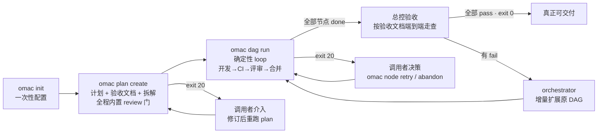
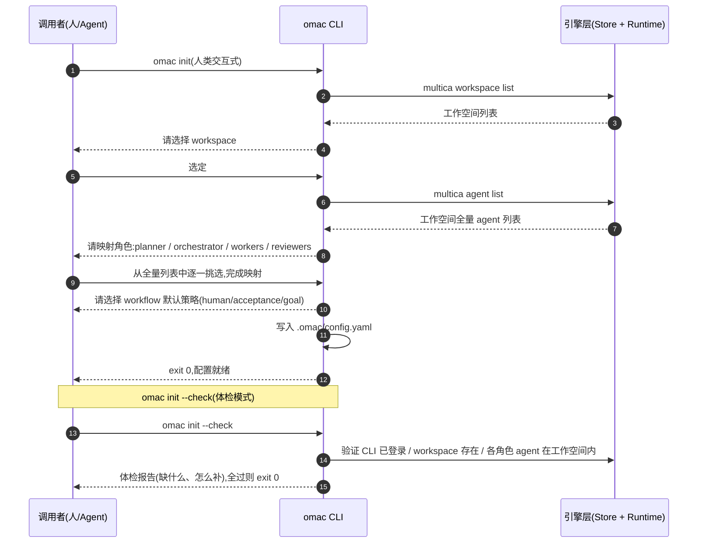
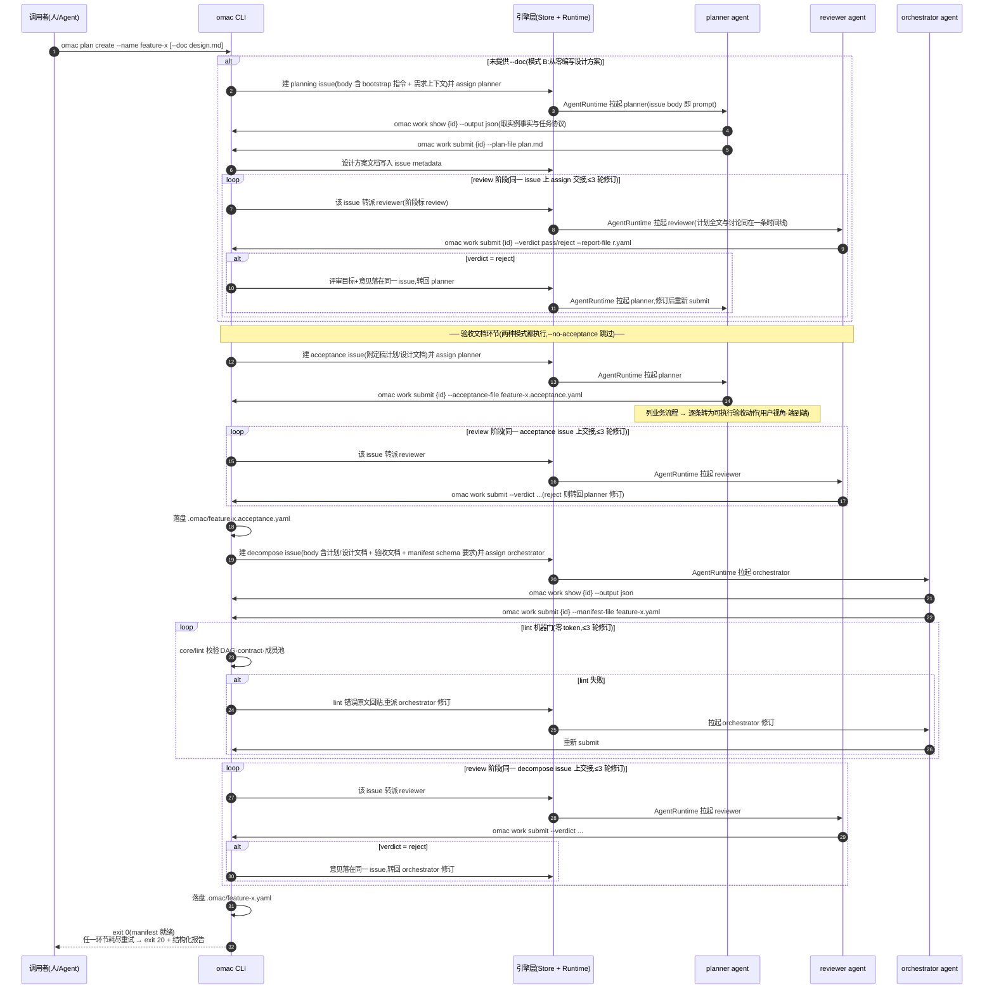
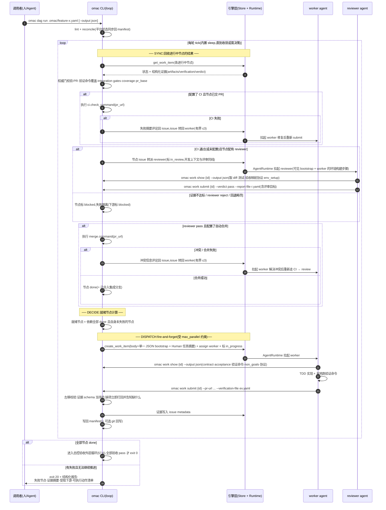
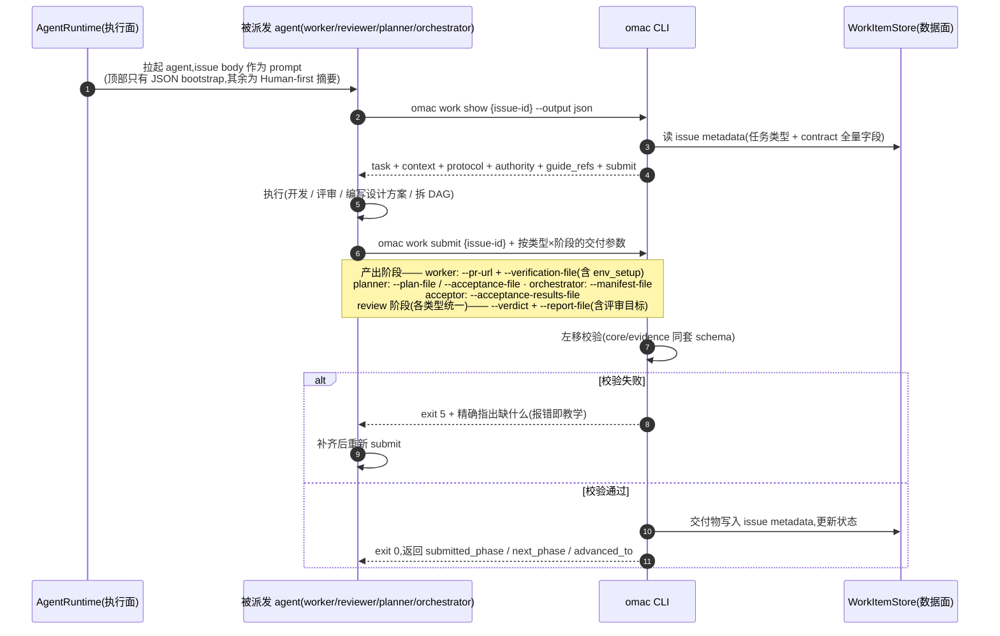
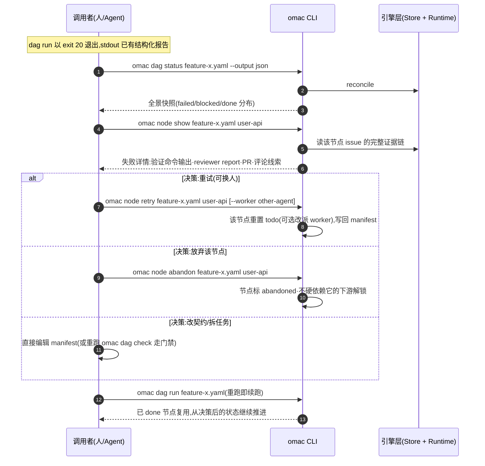
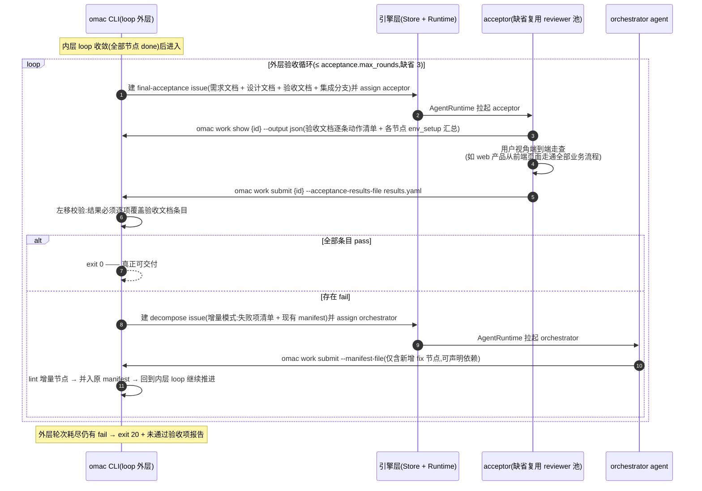

# omac CLI 设计文档

[English](../omac-cli-design.md) | [简体中文](omac-cli-design.md)

> 状态:设计定稿,待实施(P1 → P2 → P3 → P4)
> 日期:2026-07-03
> 前身:parallel-dev-skills(两个 skill + 散装脚本形态)

---

## 1. 背景与目标

### 1.1 演进背景:三次关键取舍

本设计是对前身(parallel-dev-skills,两个 skill + 散装脚本形态)在真实使用中暴露问题的三次修正。理解这三次取舍,就理解了这套机制的全部优势来源。

**取舍一:放弃「通用引擎」的平台野心,以 Multica 为核心,同时保留可移植接口。**
前身用一个 9 方法的引擎抽象兼容 GitHub / Multica / Mock。实践证明 GitHub Issues 作为协作引擎数据面太弱——状态靠 label 模拟、结构化 metadata 靠往 issue body 里藏 YAML,近 450 行适配代码都在为最弱的平台迁就接口。而 Multica 的本质区别在于它不只是 issue 平台,而是 **issue 平台 + agent 运行时**:「assign 即唤醒 agent」的执行面能力是 GitHub / Linear / Jira 都不具备的,恰好接住编排器 fire-and-forget 派发的需求。因此引擎收敛为 Multica + mock(mock 撑起全部测试与 CI),同时接口按 `WorkItemStore` + `AgentRuntime` 拆分(§12),数据面保持对 Linear / Jira 的可移植性。

**取舍二:放弃「插件」路线,也放弃 skill 形态,知识全部下沉进 CLI。**
曾评估以插件方式深度集成 Multica(类比 OpenCode 与 oh-my-opencode 的关系)。翻其源码确认:Multica **没有插件机制**——事件总线是 Go 进程内同步 pub/sub,全部集成(Slack/Lark/GitHub)都是编译期注册,不存在动态加载外部代码的入口。它的原生扩展模型是 Skill 注入 + CLI 消费。但 skill 形态有自身的分发困境:按 agent 物化导致跨 skill 引用失效(前身被迫维护双份脚本拷贝 + parity 测试)、每个 agent 都要手动导入绑定、版本漂移不可控。最终方案是**零 skill**:知识内生于 CLI 的四条通道(动态 `work show` / guide / 命令 help 与报错 / 派发载荷)。派发 issue 只保留一个 JSON bootstrap,当前协议和交付方式由 `work show` 动态生成,稳定方法论由 guide 提供；既避免版本漂移,也不把整套 Agent 协议复制进给 Human 阅读的 issue。

**取舍三:放弃 agent 驱动编排,控制反转为 Loop 驱动**——即 §1.2 的两个实测痛点,也是本设计的直接动因。

### 1.2 现状问题(实测)

前身机制由 orchestrator agent 按 skill 指引驱动编排:agent 前台运行 `run_dag.py` 阻塞进程并"监督"其执行。实测暴露两个核心问题:

1. **太贵**:整个 DAG 生命周期内,agent 的上下文持续参与每轮轮询,token 消耗与 DAG 时长成正比,而这些轮次里 99% 的工作是纯机械的状态同步。
2. **不可靠**:agent 并不会严格按 skill 要求一轮轮监督到收敛,通常监控几轮后自行退出。这是在对抗模型天性——LLM 擅长有终点的判断任务,不擅长当 while 循环的宿主。

### 1.3 目标:Loop Engineering,控制反转

把"Agent 驱动 Loop"反转为"**Loop 驱动 Agent**":

- 确定性 CLI 程序承载整个编排循环(本质就是把一个 DAG 图循环跑完);
- LLM 降级为被 CLI 派活的专家:planner(设计方案 + 验收文档)、orchestrator(拆 DAG + 增量扩展)、reviewer(评审)、worker(开发)、acceptor(总控验收)——每个都是**有终点的单次任务**,正是 LLM 擅长的形状;
- 处理异常的智能交还给**调用者**——人看报告自己处理,agent 收到结构化退出信息自己处理;
- CLI 内部不藏任何需要 LLM 的环节,不依赖任何外部定时机制(cron/autopilot)。

### 1.4 统一入口的三种使用形态

```
人(终端) / Agent(Claude Code 等) / Web UI(未来)
                    │
                    ▼
              omac CLI(唯一入口层)
```

三者本质都在消费同一套 CLI 能力。Web UI 只是 omac 的进程包装(全命令支持 `--output json`),落地为 `omac web` 子命令(§13)。

### 1.5 机制优势一览

| 维度 | 机制 | 效果 |
|---|---|---|
| 成本 | 编排循环是纯确定性程序 | 监督 token 从「全周期」降为 **0**;LLM 只花在计划、拆解、开发、评审、验收等真实智力工作上 |
| 可靠性 | loop 是代码不是提示词 | 不存在「监控几轮后自行退出」;终态只有收敛(exit 0)或带结构化报告移交(exit 20) |
| 不跑偏 | 验收文档锚定 + contract 硬合同 + 双门禁证据闭环 | 需求 → 拆解 → 开发 → 验收全程有机器可校验的锚点 |
| 可恢复 | 状态全在 manifest + 平台,循环幂等 | 任意中断重跑即续跑,支持跨机器接力 |
| 可交付 | CI / merge / 总控验收内置,done = 已合入集成分支 | 「DAG 跑完」=「按验收文档全 pass、真正可交付」,而非「代码写完了」 |
| 分发 | 零 skill,单 pipx 包 | 人 / agent / Web 同一入口;内部角色的协议随派发载荷现场注入 |
| 演进 | Store / Runtime 双接口 | 接 Linear / Jira 只增适配器,不动 pipeline(§12) |

---

## 2. 设计原则

1. **对标 multica CLI 的工程纪律**(实测 agent 友好):
   - 名词-动词命令树 + 命令分组(gh 风格 help 模板);
   - **报错即教学**:参数错误时打印错误 + 该命令完整 help,agent 用错一次即自纠错;
   - **稳定分层退出码**,调用方按码分支,不解析文案;
   - 双通道输出:stdout 出数据(`--output json|table`),stderr 出"下一步提示";
   - 长文本参数三形态互斥:`--x` / `--x-file` / `--x-stdin`;
   - 全局 flag 带 env 回退(如 `--workspace`,env: `OMAC_WORKSPACE_ID`)。
2. **零 skill 分发**:知识全部内生于 CLI(guide + help + 报错文案 + 派发载荷),不依赖任何预安装的上下文注入。skill 安装困境被消灭而非绕过。
3. **状态外置、tick 幂等**:全部状态在 manifest(YAML,git 化)+ 平台 work item,循环任意中断后重跑即续跑。
4. **重试是显式决策**:废除"启动时自动重置 blocked→todo",失败节点的处置(retry/换人/abandon)由调用者显式下达。
5. **证据校验左移 + 权威门保留**:worker `submit` 时客户端先校验证据 schema 当场打回;编排侧回收结果时保留同一套校验作为权威门(纵深防御)。

---

## 3. 总体架构

```
   人 (终端)        Agent (Claude Code / Multica agent)      Web UI (未来)
      │                        │                                │
      └────────────────────────┼────────────────────────────────┘
                               ▼
                    ┌──────────────────────────┐
                    │       omac CLI(入口层)  │
                    │  plan │ dag │ node │ work │
                    │  init │ config │ guide    │
                    ├──────────────────────────┤
                    │  pipeline(plan 流水线 / │
                    │   dag loop / 派发·回收)  │
                    ├──────────────────────────┤
                    │  core(manifest·lint·    │   ← 现有资产平移
                    │   graph·evidence)        │
                    ├──────────────────────────┤
                    │  engines(multica·mock)  │   ← WorkItemStore + AgentRuntime 双接口,
                    │                          │     GitHub 引擎删除
                    └────┬───────────────┬─────┘
                         ▼               ▼
              WorkItemStore(数据面) AgentRuntime(执行面)
              工单/证据/评论/assign   「用这个载荷唤醒这个 agent」
                         └───────┬───────┘
                                 ▼
                     平台实现(一期:Multica)
                                 │ AgentRuntime 唤醒
         ┌─────────┬─────────┴──┬──────────┬──────────┐
         ▼         ▼            ▼          ▼          ▼
      planner  orchestrator  reviewer   worker    acceptor
     (方案+验收 (拆DAG+增量  (评审+评审 (开发+环境 (总控验收)
       文档)     扩展)        目标)      步骤)
```

**身份转变**:LLM 从"驱动者"变为"被调用者"。CLI 是确定性主程序,一切 LLM 参与都是它派发的、有终点的单次任务。

---

## 4. 角色模型

| 角色 | 职责 | 由谁触发 | 产出物 |
|---|---|---|---|
| **调用者**(人/Agent) | 发起 init/plan/dag run;exit 20 后决策 | — | 决策(retry/abandon/改 manifest) |
| **planner** | 从零编写设计方案文档;方案定稿后产出**验收文档**(用户视角端到端验收点) | `plan create` | 设计方案文档 + 验收文档 |
| **orchestrator** | 把设计方案/验收文档拆解为 manifest DAG;总控验收发现问题后**增量扩展** DAG | `plan create` / 总控验收 fail 后 | manifest YAML(全量或增量节点) |
| **reviewer** | 评审设计方案、验收文档、manifest、代码 PR | **同一 issue 转派**(plan 流水线 / dag run 的 review 阶段) | 结构化 verdict + report(**含评审目标**) |
| **worker** | 按 contract TDD 开发,交 PR + 证据;修复 CI 失败与 merge 冲突 | `dag run` 派发 / CI·merge 回退 | PR + artifacts + verification(**含环境构建步骤**) |
| **acceptor(总控验收)** | DAG 收敛后按验收文档端到端走查,逐项记录 pass/fail | `dag run` 内层收敛后自动派发 | 结构化验收结果 |

- planner 与 orchestrator 是**两个独立角色**(允许配同一 agent,机制上不合并);
- reviewer 强制 ≠ 产出者(与既有 lint 规则"reviewer ≠ worker"同一原则);
- acceptor 缺省复用 reviewers 池(`roles.acceptor` 可单独指定);
- 全部角色都是工作空间里的 agent,`omac init` 从**全量 agent 列表**中挑选映射——不引入小队/分组等平台特有概念,配置模型对任何平台通用。

---

## 5. 命令树与全局约定

```
omac
  CORE(调用者/驱动侧)
    plan     create | confirm              设计方案 + DAG 拆解流水线(全程内置 review 阶段)
    dag      check | show | run | status | tick  manifest DAG 的检查、摘要与执行
    node     show | retry | abandon        exit 20 后的决策工具
  WORK(被派发 agent 侧)
    work     show | submit                 统一执行接口(5 类 issue × 产出/评审阶段)
  SETUP
    init     交互式配置 / --check 体检
    config   get | set
  GUIDE
    guide    workflow | roles | role <name> | artifact <name> | recovery
  WEB
    web      启动本地只读可视化面板(选 manifest、看进度与证据链,§13)
```

### 5.1 退出码契约(稳定,可脚本分支)

| 码 | 含义 | 出现于 |
|---|---|---|
| `0` | 成功 / DAG 收敛全部 done | 所有命令 |
| `1` | 通用错误 | 所有命令 |
| `2` | 平台/网络错误 | 所有命令 |
| `3` | 认证错误(multica CLI 未登录等) | 所有命令 |
| `5` | 校验失败(lint / 证据 schema) | dag check、work submit 等 |
| `10` | 推进中(仅单轮 tick 模式) | `dag tick` |
| `20` | **需要调用者决策**(附结构化报告) | `plan create`、`dag run` |

### 5.2 输出约定

- 面向 Human 的查询命令默认 table；Agent 执行面 `work show/submit` 默认 JSON，
  Human 调试时可显式 `--output table`；Web 与 Agent 共用同一结构化事实；
- exit 20 时结构化报告打到 stdout:失败节点、失败证据摘要(verification/verdict/PR 链接)、被牵连阻塞的下游、**可执行的下一步动作清单**(精确到完整命令行);
- "下一步提示"类引导走 stderr,不污染 stdout 数据流。

---

## 6. 配置与状态存储

**选型:YAML 文件,不用 SQLite。** 配置与状态都需要 git 化(跨机器接力、人工评审门的基础);SQLite 二进制不可 diff、不可 PR review,且此处无事务/查询需求。

```
.omac/
├── config.yaml          # omac init 产出,项目级配置,进 git
└── <name>.yaml          # omac plan 产出的 manifest DAG,进 git,状态机载体
```

`config.yaml` 结构:

```yaml
engine: multica            # multica | mock
workspace: ws_xxx
project: proj_xxx          # multica 必填:所有 issue 归入该 project(不裸建于 workspace)
                           # init 时选已有 project 或新建(新建自动关联当前 repo 为 github_repo 资源)
                           # 缺失 → dag run / work / plan 报错 exit 5;mock 引擎不需要
roles:                     # init 时从工作空间全量 agent 列表中挑选,显式落盘
  planner: planning-agent
  orchestrator: arch-agent
  workers: [backend-agent, fe-agent]
  reviewers: [review-agent-a, review-agent-b]
defaults:
  max_parallel: 4
  poll_interval: 30
  coverage_gate: 90
workflow:
  human_in_loop: true                    # plan 设计/验收产出后是否默认等人确认
  review: true                           # plan/decompose 是否默认走 reviewer 门
  acceptance_doc: true                   # plan create 是否默认生成验收文档
  goal_required: false                   # 无 --doc 时是否强制 --goal/--goal-file
ci:                                      # 可选;缺省跳过 CI 环节
  check_command: "gh pr checks {pr_url}" # 模板命令,退出码即结论
  timeout_minutes: 30
merge:                                   # 可选;缺省使用 gh pr merge 自动合并
  command: "gh pr merge {pr_url} --squash"
retry:                                    # 三类回退「回到 worker」的次数上限(缺省 3;0 = 该类失败即 blocked,不回退)
  ci: 3                                   # CI 失败 → worker 重修
  review: 3                               # reviewer reject → worker 重修(节点开发与 plan 流水线评审共用同一旋钮)
  merge: 3                                # 合并冲突 → worker 重解
acceptance:
  max_rounds: 3                          # 总控验收 → 增量修复的外层循环上限(与 retry 正交)
```

`roles` 下可选 `acceptor: <agent>`(总控验收人,缺省复用 reviewers 池)。
`workflow` 是项目级默认流程策略,命令行现有 `--no-review` / `--no-acceptance` /
`--no-confirm` 只做单次临时关闭。CI 与 merge 走**模板命令**而非平台内建——代码托管(GitHub 等)与协作引擎(Multica)是两个平台,模板命令天然解耦,且对任何 CI/托管组合通用。

---

## 7. 核心流程(按子命令阶段,泳道时序图)

### 7.0 全生命周期总览



---

### 7.1 阶段一:`omac init` — 一次性配置

**参与者**:调用者、omac CLI、引擎层。目标:选定 workspace → 列出全量 agent → 完成角色映射与 workflow 默认策略,固化进 `.omac/config.yaml`。裸 `omac init` 是人类交互式向导;agent/CI 用 `omac config set ...` 写配置后只运行 `omac init --check`,非 TTY 下裸 `omac init` 直接 exit 5 并给出 config set 示例。



---

### 7.2 阶段二:`omac plan create` — 设计方案与 DAG 拆解流水线

**参与者**:调用者、omac CLI、引擎层、planner、reviewer、orchestrator。

两种模式一条流水线:带 `--doc` 跳过 planner 设计环节;不带则 planner 先编写设计方案。方案定稿后(含评审通过),planner 再产出**验收文档**——先列出方案涉及的业务流程,再把每条流程转换为用户视角、端到端、可执行的验收动作(如 web 产品从前端页面走通全功能)。验收文档的双重作用:①需求目标的锚定点(orchestrator 拆解时 contract.acceptance 须锚定其条目,开发不跑偏);②总控验收阶段的验收目标清单(§7.6)。

**全部 review 门内部衔接,不暴露评审参数**,开关只有 `--no-review`(一刀切跳过所有 review 门)与 `--no-acceptance`(跳过验收文档环节)。每个 LLM 环节的修订循环有界(评审轮次读 `config.retry.review`,缺省 ≤3),耗尽则 exit 20 移交调用者。

**issue 的范围 = 一个完整阶段**:设计方案、产验收文档、拆解各对应一条 issue,产出 → 评审 → 回退修订的全部往返都发生在**同一条 issue** 上。评审不是新建 issue,而是把该 issue **转派(assign)给 reviewer**,评审目标与意见以评论落在同一时间线——上下文连贯不断。交接方式由 AgentRuntime 实现决定:Multica 的任务主通道就是「assign 即唤醒」(转派即再次唤醒新 assignee,所有权与状态清晰),故 Multica 选 **assign 交接**;评论 @mention 也能触发 agent,留作不支持转派语义平台的备选。



> `omac dag check <file>`:调用者自己拆好了 manifest 时,只走 lint 门 + manifest review 阶段。
> `omac dag show`:查看已注册 manifest 的摘要。

---

### 7.3 阶段三:`omac dag run` — 确定性 Loop 执行

**参与者**:调用者、omac CLI(loop 本体)、引擎层、worker、reviewer。

CLI 前台循环 sync → decide → dispatch,内置 sleep,**不依赖外部定时器**。全部状态在 manifest + 平台,循环幂等——中断重跑即续跑。

节点生命周期(带 `*` 的环节由配置决定是否存在):

```
todo → in_progress → ci_check* → in_review → merging* → done
            ▲______________│____________│_______│
              三类回退一律回到 worker:CI 失败 / 评审 reject / merge 冲突
              (每类有界,次数读 config.retry.{ci·review·merge},缺省 3,耗尽 → blocked)
```

> 读图约定:上表是一条**带环的**生命周期,不是单向前推。``ci_check`` 环节由
> ``config.ci`` 决定是否存在(缺省跳过);CI 失败经 ``delivery.advance_delivery``
> 把节点顶回 ``in_progress`` 转派 worker,同时 ``WorkItem.bounces.ci``+1;
> ``in_review`` 的评审 reject 同理(``bounces.review``)。两类回退各自耗尽上界后
> 节点标 ``blocked`` 并隔离下游。

**done 的语义 = 已合入集成分支**(配置了 `merge` 时),消除"评审过了但没合"的悬空中间态。未配置 CI/merge 时对应环节自动跳过,退化为现行为。

**每个 DAG 节点对应一条 issue**,覆盖开发 → CI → 评审 → 合并的完整阶段:worker 与 reviewer 之间的交接是同一 issue 的**转派**,CI 失败/评审 reject/merge 冲突的回退同样是转回 worker——全程一条时间线,不新建评审 issue。



> `omac dag status <manifest>`:随时查看快照(reconcile + 各节点状态),不推进。
> `omac dag tick <manifest>`:单轮推进后立即退出(exit 0/10/20),高级/调试用。
> 有界运行:`--max-rounds N` / `--max-minutes N`,给不想长阻塞的 agent 调用者分段跑(幂等 = 分段即续跑)。

---

### 7.4 阶段四:`omac work` — 被派发 agent 的统一接口(执行侧视角)

**参与者**:AgentRuntime(引擎执行面)、被派发 agent(全部角色通用)、omac CLI、WorkItemStore(引擎数据面)。

被派活的 agent 永远只需要两个命令。**issue 的范围是一个完整阶段**——产出、评审、回退往返都在同一条 issue 时间线上;当前阶段(phase)与承担者由 issue metadata + assignee 表达,交接 = 转派(assign)。`show` 按(issue 类型 × 当前阶段 × 你的身份)输出对应协议,`submit` 按同一维度校验交付物。issue 类型共五种,**review 是各类型内的阶段而非独立 issue**:

| issue 类型 | 覆盖阶段(同一 issue 内) | 产出阶段 submit | review 阶段 submit |
|---|---|---|---|
| `plan` | planner 编写设计方案 → review | `--plan-file` | `--verdict --report-file`(必含评审目标) |
| `acceptance` | planner 产验收文档 → review | `--acceptance-file`(业务流程 → 逐条验收动作) | 同上 |
| `decompose` | orchestrator 拆解/增量扩展 → lint → review | `--manifest-file`(增量模式只含新增节点) | 同上 |
| `develop` | worker 开发 → CI → review → merge | `--pr-url --verification-file`(env 依赖时须含 env_setup) | 同上 |
| `final-acceptance` | acceptor 端到端走查(无 review 阶段) | `--acceptance-results-file`(逐项 pass/fail + 问题记录) | — |



**派发 issue body 固定模板**(CLI 生成,Human-first,不依赖系统提示词与预装 skill):

```
[顶部:唯一 Agent 入口]
omac work show <id> --output json

[Human 任务说明]
标题 / 类型 / 执行角色 / 目标 / 完成标准 / 任务详情 / 非目标 /
主要代码归属范围 / 交付约束 / 目标仓库 / 上游 issue 链接
```

issue 不复制 `work submit`、guide 清单或角色硬协议。Agent 从 `work show.submit` 获取精确
交付命令,从 `guide_refs` 按需加载静态知识；冲突时实例事实和 contract 优先。

---

### 7.5 阶段五:`omac node` — 异常处理闭环(exit 20 之后)

**参与者**:调用者、omac CLI、引擎层。核心原则:**重试是显式决策**,不再自动发生。



---

### 7.6 阶段六:总控验收与 DAG 增量扩展(`dag run` 内置的外层循环)

**参与者**:omac CLI、引擎层、acceptor、orchestrator。核心原则:**全部节点 done ≠ 可交付**。开发阶段收敛后,以 plan 阶段产出的验收文档为目标清单,做一次用户视角的端到端总控验收;发现的问题变成增量节点回到**同一个 DAG** 继续推进,不起新 DAG。



要点:

- **验收有据可依**:acceptor 不凭感觉验收,`work show` 直接给出验收文档的逐条动作清单;结果 schema 强制逐项映射,漏项在左移门被打回。
- **问题闭环回原 DAG**:orchestrator 走 `decompose` 任务的**增量模式**——产出的 manifest 片段只含新增 fix 节点,CLI lint 后并入原 manifest。已 done 节点不受影响,状态机语义不变,断点续跑机制天然适用。
- **有界**:外层循环受 `acceptance.max_rounds` 约束,防止"验收→修→验收"无限烧 token;耗尽后 exit 20,把未通过项清单交还调用者。
- 未产出验收文档时(`--no-acceptance`),总控验收退化为跳过,`dag run` 收敛即 exit 0——保持向后兼容。

---

## 8. 证据与门禁(两道门,一套 schema)

```
worker submit ──► 左移门(omac work submit,客户端)
                    │  schema 完整性·验证命令覆盖 contract 声明·coverage 达标
                    │  不过 → exit 5 当场打回,精确告知缺什么
                    ▼
              issue metadata(平台,唯一事实源)
                    ▼
dag run 结果回收 ──► 权威门(编排侧,信任但验证)
                    │  同一套 core/evidence 校验 + reviewer verdict 检查
                    │  不过 → 节点 blocked + 失败隔离
```

两道门共用 `core/evidence.py` 一套 schema——左移门优化返工时延,权威门守住最终正确性,没有第二套标准。

在既有 schema 上新增三类证据字段(均在左移门强制):

| 字段 | 必填条件 | 作用 |
|---|---|---|
| `verification.env_setup` | contract 声明 integration_gates 或 env 依赖时必填 | worker 自测通过后记录**环境构建步骤**;reviewer 的 `work show` 直接呈现,照做即可复跑,消除"评审被环境卡住" |
| `review_report.review_goals` | review 阶段必填 | reviewer 附上**评审所依据的目标**(验收映射、覆盖率、集成门、设计引用);目标与意见都落在同一 issue 时间线,转回产出者时一并可见——开发者朝目标修,而不是只修列出的问题 |
| `acceptance_results` | final-acceptance 任务必填 | 逐项映射验收文档条目的 pass/fail + 问题记录;漏项在左移门打回 |

---

## 9. 知识分发:零 skill

原两个 skill 的内容全部迁入 CLI 四个内生通道,按职责分层:

| 通道 | 承载内容(原出处) |
|---|---|
| `omac work show` | 当前实例状态/依赖/回退计数、contract/previous_review、真实交付与证据、动作、权威顺序、最小 guide_refs 和精确 submit 命令 |
| `omac guide workflow/roles/role/artifact/recovery` | Agent 的稳定方法、角色协议、产物 schema 与恢复手册；不得覆盖实例事实 |
| 各命令 Long help | 命令发现与入口路由,不复制整套角色协议 |
| exit 20 / exit 5 报告 | 现场发牌的"下一步动作",精确到完整命令行 |
| 派发 issue body | Human-first 任务说明 + 一个 `work show --output json` Agent 入口 |

**分发闭环**:Human 从 issue 读清目标与完成标准；Agent 先取动态实例事实,再按
`guide_refs` 加载稳定知识并通过 `work submit` 交付。无 AGENTS.md 依赖、无薄 skill、
无额外 skill 导入运维步骤。

---

## 10. 仓库终态与迁移计划

### 10.1 终态结构

```
├── pyproject.toml            # console_script: omac;pipx install 分发
├── src/omac/
│   ├── cli/                  # 命令树 / help 模板 / 退出码 / 输出层
│   ├── pipeline/             # plan 流水线 / dag loop / 派发·回收
│   ├── core/                 # manifest·lint·graph·evidence(现有资产平移)
│   ├── engines/              # WorkItemStore + AgentRuntime 双接口;multica·mock 各实现两者
│   └── guide/                # guide 各 topic 文本
├── tests/
└── docs/
```

### 10.2 删除与更名清单

- `skills/` 整目录(两个 SKILL.md + 双份 scripts 拷贝)
- `sync_to_executor.sh`、`test_skill_scripts_parity.py`(vendor+parity 机制)
- `scripts/install.sh`(skill 安装脚本)
- `engines/github.py`(GitHub 引擎;若有存量用户先 deprecated 一个版本)
- README 中 skill import / agent 绑定 / agent env set 相关章节
- `run_dag.py` 中"启动时自动重置 blocked→todo"逻辑(run_dag.py:217-221,改为 `omac node retry` 显式决策)

术语更名(资产平移时同步执行,消除硬翻译行话,面向用户的输出与文档一律用通用说法):

| 旧术语(代码/文档) | 新术语 | 代码标识符 |
|---|---|---|
| harvest / 收割 | **结果回收** | `collect_results` |
| in-flight / 在飞节点 | **进行中节点** | `running_nodes` |
| frontier | **就绪节点** | `ready_nodes` |

### 10.3 实施顺序

| 阶段 | 内容 | 交付判断 |
|---|---|---|
| **P1** | CLI 骨架(命令树/help/退出码/输出层)+ 引擎层按 `WorkItemStore` + `AgentRuntime` 双接口重组(Multica/mock 各实现两者)+ `init` + `dag run` 退出契约改造 + `node show/retry/abandon` | mock 引擎下全链路可跑;"agent 当保姆"被消灭 |
| **P2** | `work show/submit`(六类任务统一接口 + 左移校验)+ 证据 schema 扩展(`env_setup`、`review_goals`)+ 派发 body 模板 | live Multica 下 worker/reviewer 全程零 skill 走通 |
| **P3** | `plan create/check/show` 流水线(planner/orchestrator 双角色 + 验收文档环节 + 全程 review 门)+ `guide` 全量迁移 + 删除清单执行 | skills/ 删除,README 重写为 CLI 产品文档 |
| **P4** | 交付闭环:CI 监控与回退、自动 merge 与冲突回退、总控验收 + DAG 增量扩展外层循环 | 一个 feature 从 plan 到「验收全 pass 才 exit 0」全程无人工递手 |
| **P5(可选)** | `omac web` 只读可视化面板:内嵌 SPA + 与 CLI 共用命令层 + status 短缓存(§13) | 浏览器里选 manifest、看 DAG 进度与证据链;API 输出与对应 CLI 命令的 JSON 逐字节一致 |

---

## 11. 前置条件与风险

| 项 | 说明 | 缓解 |
|---|---|---|
| runtime 机器需装 omac | 与"装 multica CLI"同级前置,`pipx install` 一次 | 失败响亮:Agent 第一步 `omac work show --output json` 即 command not found,回报到 issue,编排侧可见;`guide workflow` 写明运维要求 |
| agent 调用者跑 `dag run` 长阻塞 | CLI 自含 loop 的固有代价 | `--max-rounds/--max-minutes` 有界分段(幂等=续跑);或后台运行 + `dag status --json` 轮询 |
| plan 流水线 LLM 环节质量 | planner/orchestrator 产物可能反复不过门 | 修订循环有界(≤3 轮),耗尽即 exit 20 移交调用者,不无限烧 token |
| 向后兼容 | 存量 `.omac/*.yaml` manifest | manifest schema 不变,`dag run` 直接消费;仅驱动方式变化 |

---

## 12. 平台可移植性与未来扩展(Linear / Jira)

> 定位:**引擎接口拆分是当期工作(P1),平台实现是未来工作**。本节回答"深度依赖 Multica 之后,还能接 Linear/Jira 吗"——接口在一期就按最终形状落地,未来接入是增量适配而非重构;但一期只实现 Multica(+mock),不为 Linear/Jira 写任何代码。

### 12.1 关键洞察:依赖拆成两个平面

把设计对 Multica 的依赖逐项分类,性质截然不同:

| 依赖项 | 平面 | Linear | Jira | 说明 |
|---|---|---|---|---|
| issue 创建/查询/评论/assign | 数据面 | ✅ | ✅ | 任何 issue 平台都有 |
| 状态流转 | 数据面 | ✅ | ⚠️ | Jira 走 workflow transition,须按实例映射 transition id(经典适配脏活) |
| 结构化 metadata(证据存储) | 数据面 | ⚠️ | ✅ | Jira custom fields 是一等公民,**比 GitHub 强**;Linear 无任意自定义字段,需退回"description 藏 YAML 块"手法 |
| workspace / agent 成员池 | 数据面 | ✅ team | ✅ project | 角色映射已在 `config.yaml`,不依赖平台 |
| **assign 给 agent → daemon 自动拉起 agent CLI** | **执行面** | ❌ | ❌ | **唯一不可替代的依赖,即 Multica 的本体价值** |

结论:Linear/Jira 是"GitHub Issues 替代品"这一判断只对**数据面**成立(Jira 的 metadata 能力甚至让适配比曾经的 GitHub 引擎更干净)。但 Multica = issue 平台 **+ agent 运行时**;在 Jira 里 assign 给 `backend-agent` 不会有任何东西醒过来干活。`dag run` 的 fire-and-forget 派发,全靠 Multica daemon 在对面接住。

Linear 的 Agents API(第三方 agent 可作为成员被 assign、收 webhook)只解决"派单通知",**计算仍需自备**;Jira 同理。分界线不变:tracker 负责派单,运行时得另想办法。

### 12.2 本设计已内建的可移植性

omac CLI 设计相比旧架构,已把多项职责从平台收回 CLI 侧,平台耦合面收敛到引擎适配层一个点:

- 角色系统在 `config.yaml`,不依赖平台的分组/内置角色概念;
- review 门、修订循环、门禁全部由 CLI 编排,不依赖平台工作流;
- 证据 schema 是自有的 `core/evidence.py`,平台只是存储介质;
- `omac work show/submit` 使执行侧 agent 与平台隔离——worker 不直接碰平台 API,全走 omac。

这正是保留 `CollaborationEngine` 抽象(而非删光只留 Multica)的回报。

### 12.3 引擎拆分:Store 与 Runtime(接口 P1 落地,实现一期仅 Multica)

为免未来重构,**接口拆分在 P1 即按最终形状落地**:引擎自始由两个接口组成,Multica 与 mock 各自同时实现两者(Multica 平台恰好一体承担两个角色,实现内部可共用同一个 CLI client)。接入 Linear/Jira 时只是新增 Store 实现并选定 Runtime 方案,**不再动接口与 pipeline**:

```
CollaborationEngine
  ├─ WorkItemStore   数据面:CRUD / status / metadata / comment / assign
  │                    一期实现:MulticaStore · MockStore
  │                    未来:LinearStore / JiraStore(各 ~500 行,与现 multica.py 同量级)
  └─ AgentRuntime    执行面:「用这个载荷唤醒这个 agent」
                       一期实现:MulticaRuntime(daemon 原生)· MockRuntime
                       未来:下述选项
```

**Multica 参考实现映射(一期)**——两接口共用同一个 `multica` CLI client,认证由 CLI 自管(`~/.multica`),接口契约沿用现 `base.py` 的 docstring 约定(写后读一致性、确定性 id):

| WorkItemStore 方法 | multica CLI 实现 |
|---|---|
| `list_members(scope)` | `multica agent list`(工作空间全量 agent;不使用小队/分组等平台特有概念) |
| `create_work_item(...)` | `multica issue create` → 拿确定性 issue id → `issue metadata set` 逐字段写入 |
| `get_work_item(id)` | `multica issue get <id>` + metadata 解析还原全部业务字段 |
| `update_work_item_metadata(...)` | `multica issue metadata set <id> --key ... --value ...` |
| `list_work_items(scope)` | `multica issue list --output json`(注意服务端单页上限 100,需翻页) |
| `add_comment(id, msg)` | `multica issue comment <id> --message ...` |
| `update_status(id, status)` | `multica issue update <id> --status ...`(业务态 ↔ 平台态双向映射) |
| `assign_work_item(id, who, role)` | agent 名 → id 解析 → `multica issue assign --to <id>` + metadata 同步 worker/reviewer 字段 |

| AgentRuntime 方法 | multica 实现 |
|---|---|
| `wake(work_item, agent)` | **隐式实现——assign 即唤醒**:issue 被 assign 给 agent 后,该 agent 所在机器的 Multica daemon 自动认领任务,并以 issue 内容为 prompt 拉起 agent CLI。因此 `MulticaRuntime.wake` 只需确认 Store 侧 assign 成功,无独立 API 调用 |
| 阶段交接(评审/回退) | **同一 issue 转派新 assignee 即再次唤醒**——「assign 即唤醒」天然支持接力棒传递,时间线连续、所有权清晰,是 Multica 下的首选交接方式;评论 @mention 亦可触发 agent,留作不支持转派语义平台的备选(由各 Runtime 实现自行选择) |
| 执行进度回流 | 不提供独立通道——agent 的交付经 `omac work submit` 写回 issue metadata,编排侧统一走 `Store.get_work_item` 轮询,与其他平台形态一致 |

这个映射也解释了接口拆分为何不增加 Multica 的实现成本:Multica 恰好把两个角色做在了同一个平台上,`MulticaRuntime` 薄到近乎声明——而这正是其他 issue 平台(Linear/Jira)缺失、需要另行选型的那一半(见下表)。

执行面选项,按推荐排序:

| 选项 | 机制 | 评价 |
|---|---|---|
| **1. `omac daemon`(自带轻量运行时)** | omac 长出 runner 子命令:轮询 tracker 上 assign 给已配置 agent 身份的 issue → 本机准备工作目录 → 以 issue body 为 prompt 拉起对应 agent CLI → 等退出 | Multica daemon 的极简复刻(无需 session 恢复/多 provider 探测/流式回传),是真正的增量工作量,但有界。**推荐** |
| 2. 借用 tracker 的 agent 生态 | Linear 已入驻的 Devin/Cursor 等可被直接 assign | bootstrap 依赖对方 runtime 装得上 omac(Devin 的 VM 可以,多数托管 agent 不行),可控性差,机会性方案 |
| 3. Multica 做运行时 + Linear/Jira 做展示镜像 | 双平台同步 | 两个事实源是万恶之源。**不推荐** |

### 12.4 当期纪律(P1 起生效)

1. **pipeline 代码永远只调 Store/Runtime 接口,绝不直接 shell out `multica` CLI**——code review 红线;
2. **接口的 docstring 契约(写后读一致性、确定性 id)保持平台中立措辞**,不渗入 Multica 术语。

守住这两条,加上 P1 已落地的双接口,未来接 Linear = 一个 ~500 行 Store 适配器 + 选定执行面方案;接 Jira 同理再加 transition 映射。边界同样明确:**接口当期落地,实现不预建**——不为 Linear/Jira 留空壳适配器,第二个平台的实现由其真实约束驱动。

---

## 13. Web 可视化面板:`omac web`

> 定位:§1.4「三种使用形态」中 Web UI 的落地——**CLI 的第三种调用者,不是第二套系统**。Web 层零业务逻辑、零独立状态:每个 API 端点与一条 CLI 命令一一对应,响应体就是该命令 `--output json` 的原样输出。用户在页面上做的每一次"查看",本质都是一次 omac 命令调用。

### 13.1 命令与形态

```
omac web [--port 8321] [--host 127.0.0.1] [--open] [--refresh 10]
```

- **单进程、零依赖**:HTTP 服务 + 内嵌静态单页应用(前端构建产物随 pip 包分发,无 CDN、无 Node 运行时依赖,离线可用);`omac web` 即起,Ctrl-C 即停,无守护进程。
- **默认只绑 `127.0.0.1`**,本机工具无鉴权;显式指定 `--host 0.0.0.0` 对外暴露时,强制要求 `--token`,所有请求校验请求头。
- `--open` 启动后自动打开浏览器;`--refresh` 控制前端轮询间隔(秒)。

### 13.2 架构:同一命令层,两种呈现

```
浏览器 SPA ──── HTTP / JSON ────► omac web(薄路由层)
                                     │ 进程内调用
                              命令实现层(CLI 子命令与 web 端点共用同一函数)
                                     │
                              pipeline / core / engines(Store + Runtime)
```

新增一条纪律(与 §12.4 的红线同级):**web 路由层只做「解析参数 → 调命令函数 → 原样返回 JSON」**,禁止在 web 层直接读 manifest、调 engine、二次加工数据——那些都是命令层的职责。保证手段:mock 引擎下的一致性测试,逐端点断言 **API 响应 == 对应 CLI 命令 `--output json` 的输出**。这条纪律保证了三种调用者(人/agent/Web)看到的永远是同一个事实,CLI 是唯一事实源。

### 13.3 页面信息架构

打开即是 manifest 选择页,选定后进入该 manifest 的仪表盘:

| 页面区域 | 内容 | 数据来源(← 对应 CLI 命令) |
|---|---|---|
| **manifest 选择器** | 扫描 `.omac/*.yaml`(排除 config.yaml),显示各自进度摘要,记住上次选择 | `GET /api/manifests` |
| **DAG 总览** | DAG 图可视化,节点按状态着色(todo / in_progress / ci_check / in_review / merging / done / blocked / abandoned),依赖边、进度统计(x/y done)、当前所处循环(内层 tick / 总控验收第 N 轮) | `GET /api/dag/status` ← `dag status --output json` |
| **节点详情**(点节点展开) | contract 全量(objective / acceptance / non_goals / 验证命令)、证据链(verification、评审 report + 评审目标、env_setup)、PR 链接、平台 issue 链接(跳转看完整时间线)、回退计数 | `GET /api/node/{key}` ← `node show --output json` |
| **静态信息页** | config.yaml 只读呈现(角色映射、CI/merge 配置)、manifest 原文、验收文档逐条清单 | `GET /api/config` ← `config get --output json`;`GET /api/plan/acceptance` |
| **异常面板** | 与 exit 20 同款的结构化报告:失败节点、证据摘要、受阻下游、**可复制的下一步动作命令**(`omac node retry ...`) | `dag status` 输出中的 needs_decision 字段,无独立端点 |

### 13.4 刷新模型:前端轮询 + 服务端短缓存

- 前端**定时轮询**(缺省 10s),不引入 WebSocket/SSE——数据源头(引擎对平台的 reconcile)本身就是十秒到分钟级,秒级实时是伪需求,不为它引入实时基础设施。
- `dag status` 每次调用会触发 reconcile(打平台 API)。web 服务端对 status 结果做 **TTL = poll_interval 的短缓存**:多个浏览器标签、多次轮询共享同一次 reconcile,页面侧的轮询放大不会传导为平台 API 调用放大。

### 13.5 边界:一期只读,仪表盘不是方向盘

- **一期无任何操作按钮**。`dag run` 是长驻前台循环,归属权在终端调用者,web 不代跑;异常面板给出的是**可复制的 CLI 命令**,处置动作回到终端执行。
- 二期再考虑操作能力(`POST /api/node/{key}/retry|abandon` + 确认对话框,复用同一命令层;`dag run` 以受管后台任务形式提供)——届时鉴权从"可选"升级为"强制"。
- 不做多项目聚合、不做用户体系、不做历史统计存储(与 §6 的无 SQLite 原则一致)。

这个边界让一期的 web 保持在最有价值、最零风险的形态:**观测面板**——把 CLI 已经能回答的所有问题,变成一眼能看懂的页面。
